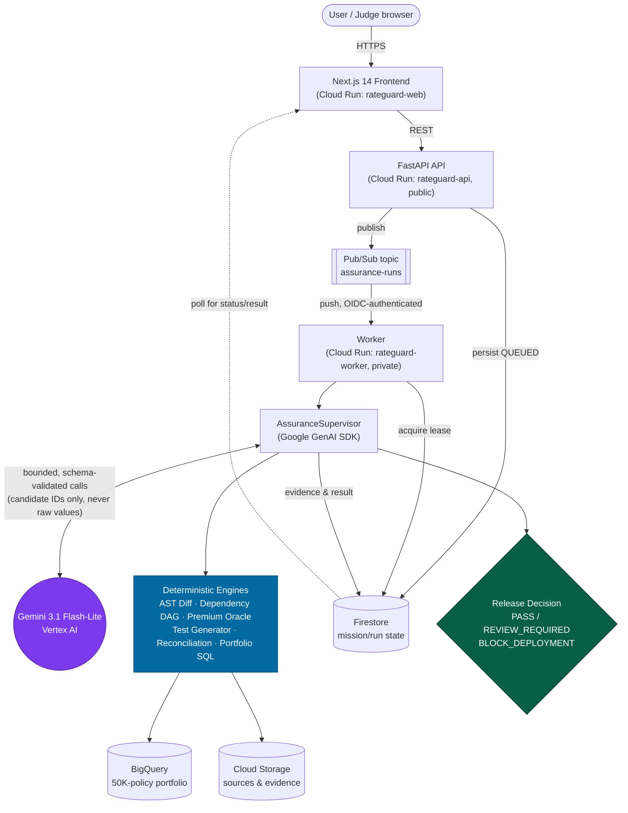
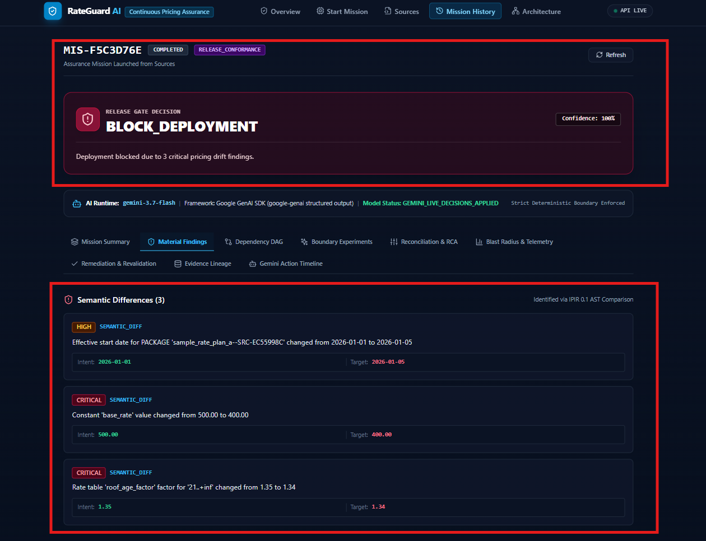
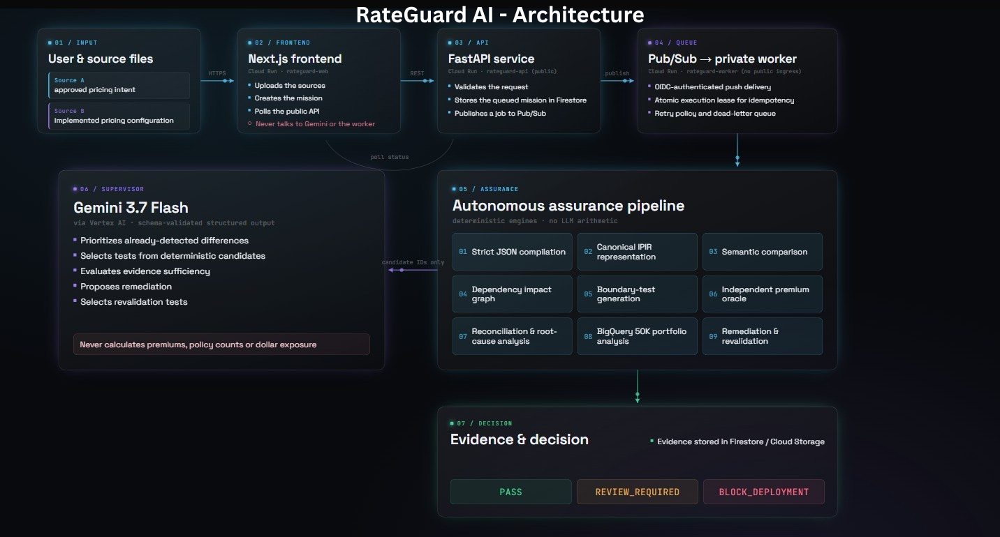
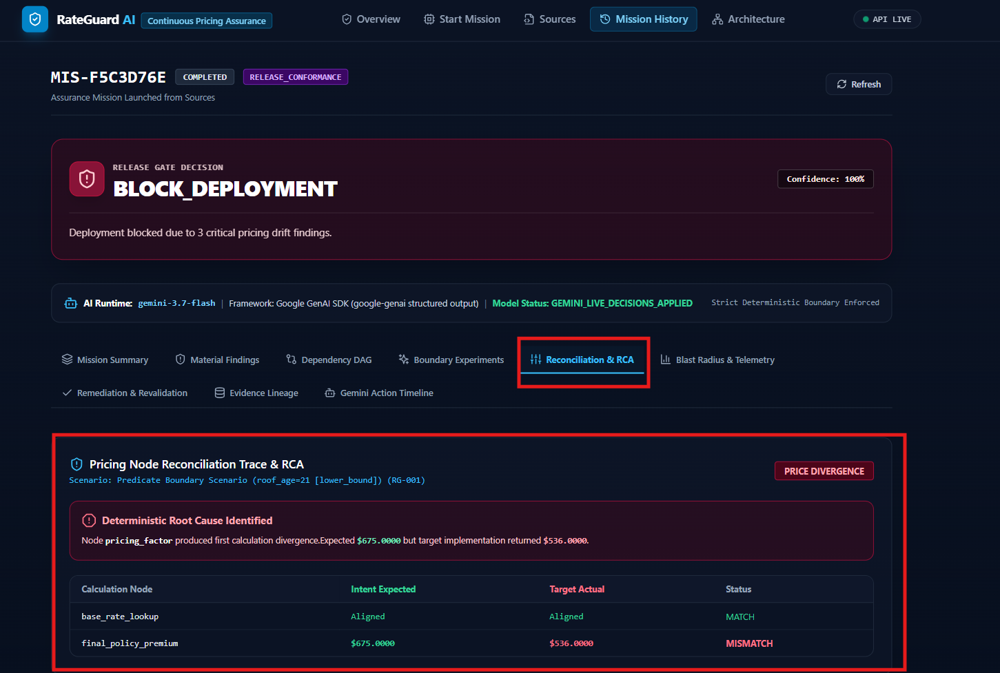
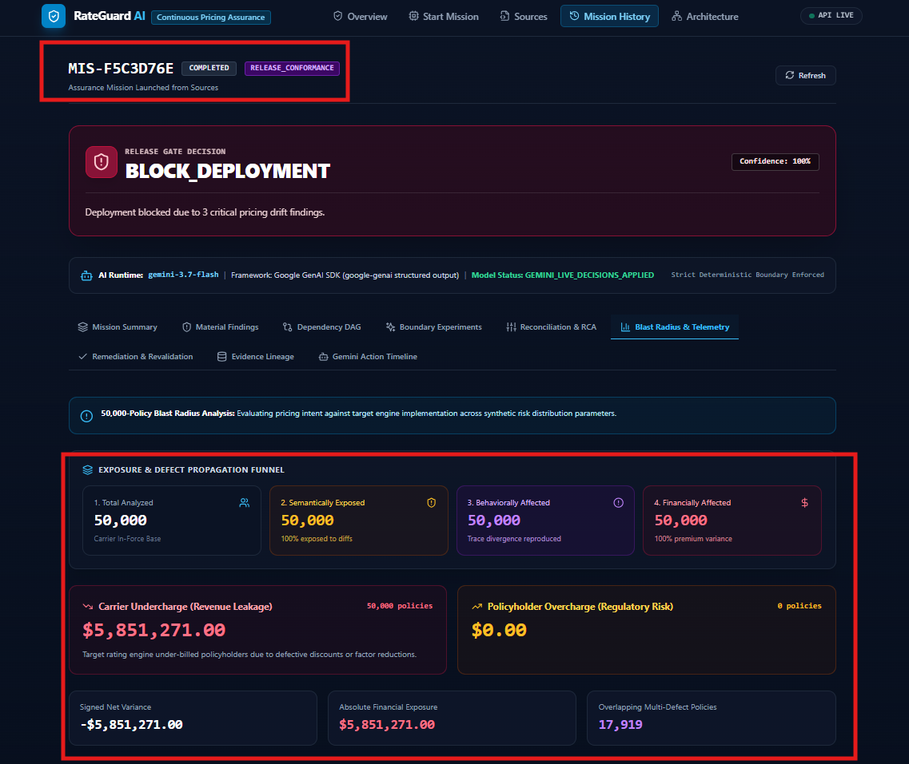
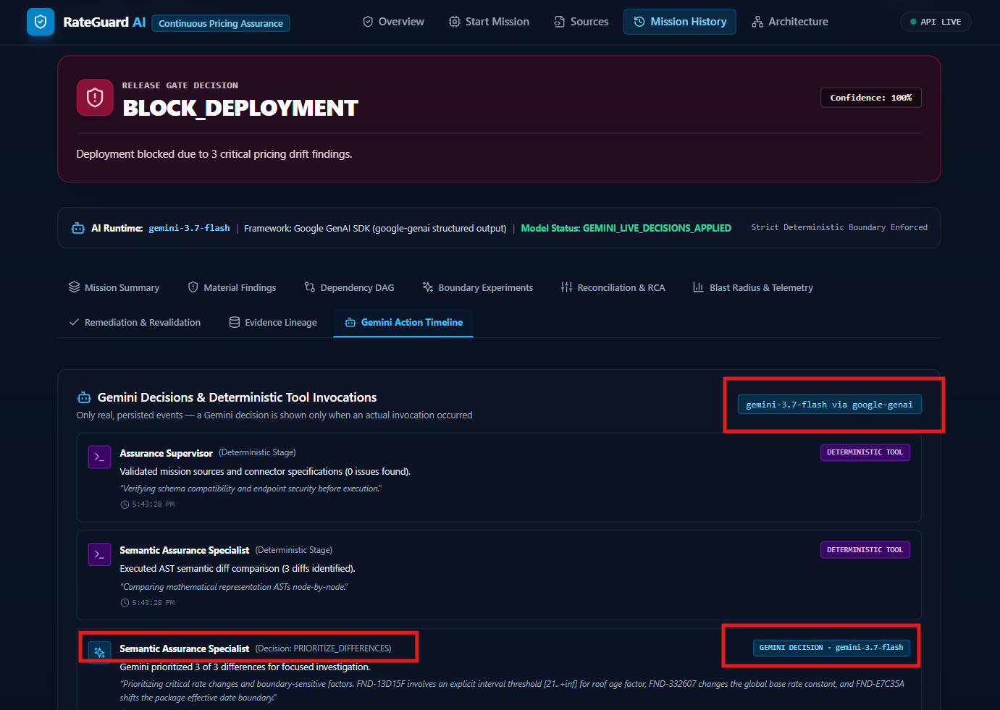
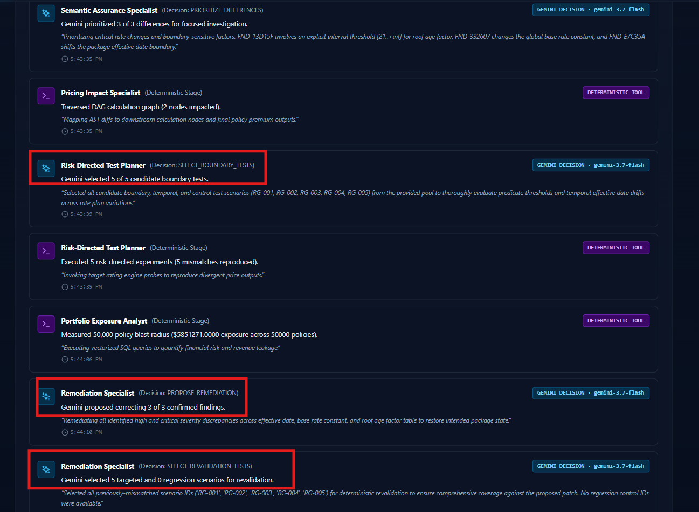
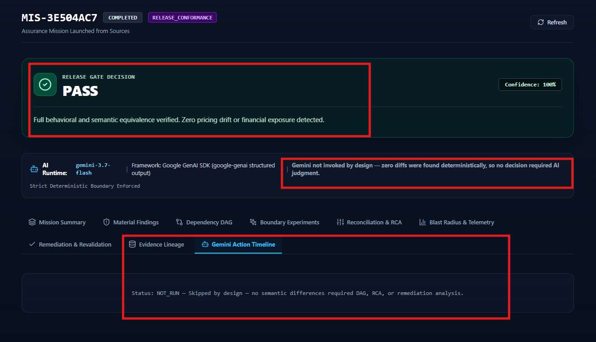

# RateGuard AI — Continuous Pricing Assurance for Insurance

RateGuard AI is a vendor-neutral, agentic insurance pricing assurance platform. It independently verifies that insurance pricing logic stays semantically correct as it moves from a regulatory filing, through an actuarial spec, into a rating engine implementation — catching silent pricing defects before they reach production.

**Production URL:** https://rateguard-web-nwhotixfva-uc.a.run.app

## Positioning: RateGuard Complements Your Rating Platform, It Does Not Replace It

> PricingCenter is where insurers author and configure rates. RateGuard is an independent assurance layer that
> verifies whether the deployed implementation matches the approved actuarial intent. RateGuard complements
> Guidewire, Duck Creek, legacy platforms, and custom rating engines; it does not replace them.

| Capability | Rating platform (e.g. PricingCenter) | RateGuard |
| :--- | :--- | :--- |
| Rate authoring & configuration | Yes — its core function | No |
| Deployed-engine verification | Not its function | Yes |
| Approved-intent comparison | Not applicable | Yes — against an independently held approved spec |
| Cross-engine / multi-vendor support | Single platform | Any REST target implementing RateGuard's connector contract |
| Portfolio customer-impact quantification | Not its function | Yes — bounded synthetic 50,000-policy portfolio |
| Tamper-evident evidence bundle | Not its function | Yes — SHA-256 hashed bundle with a manifest |
| Independent release decision | Not its function | Yes — PASS / BLOCK_DEPLOYMENT / REVIEW_REQUIRED |

**Who gets the most value:** insurers running multiple rating engines, migrating between engines, changing rates
frequently, handing pricing logic across separate teams, or carrying meaningful market-conduct exposure. A carrier
on a single, deeply trusted engine with infrequent rate changes may reasonably see RateGuard as optional. See the
[`/positioning`](frontend/src/app/positioning/page.tsx) page in the deployed app for the full framework.

## The Problem

Insurance pricing logic is written once (as an approved actuarial filing) and then re-implemented multiple times: in rating engines (Guidewire, Duck Creek, Earnix, custom REST APIs), in spreadsheets, in legacy systems. A rule that is correct at its source can be silently mistranslated during implementation:

- **Approved filing:** `roof_age >= 21 → factor 1.35`
- **Implemented engine:** `roof_age >= 21 → factor 1.25`

The code runs cleanly, throws no exceptions, and passes ordinary smoke tests — so incorrect customer premiums ship to production undetected. There is no standard, vendor-neutral way to prove that a rating engine implementation actually matches the filing it's supposed to implement.

## The Innovation

RateGuard converts a supported pricing source — native IPIR/structured JSON, or the RateGuard Controlled Workbook v1 contract — into a canonical **Insurance Pricing Intermediate Representation (IPIR)**: an executable AST and dependency graph. Because every source lands in the same representation, RateGuard can compare *any* two of them symmetrically, without treating any vendor or format as the privileged source of truth. Upload a RateGuard-supported source template; the compiler validates the schema and fails closed when required pricing elements cannot be verified — RateGuard does not claim to analyze an arbitrary spreadsheet or filing PDF, only what it can genuinely and verifiably compile (see [Supported Source Formats](#supported-source-formats)).

From there, a bounded, structured Gemini supervisor and a suite of deterministic engines work together to not just detect that two sources differ, but to prove *how much it matters*: which calculation nodes are affected, which of 50,000 synthetic policies in the demo portfolio would be mispriced, and by how much money — then propose and verify a fix.

## Agentic Gemini Workflow

RateGuard runs a mandatory deterministic evidence pipeline unconditionally (validation → IPIR comparison → dependency impact → boundary-test generation → premium oracle → target execution → trace reconciliation), and consults **Gemini 3.1 Flash-Lite** (via the Google GenAI SDK against Vertex AI) at a small, bounded set of structured decision points inside `AssuranceSupervisor`. There are seven distinct decision-point *kinds* in the code; which ones actually fire depends on what a given mission finds:

| Decision point | What Gemini decides | Fires when |
| :--- | :--- | :--- |
| `CHOOSE_EXTRACTION_STRATEGY` | Which extractor to use for a genuinely ambiguous uploaded source | Arbitrary/legacy Excel and PDF extraction is out of scope in production (see [Supported Source Formats](#supported-source-formats)); this decision point exists in code but is not reachable via the live upload path today. The Controlled Workbook v1 `.xlsx` path is fully deterministic and never reaches this decision point at all. |
| `PRIORITIZE_DIFFERENCES` | Which already-detected semantic differences deserve focused boundary testing | Whenever semantic differences exist |
| `SELECT_BOUNDARY_TESTS` | Which deterministically-generated candidate boundary tests to execute | Whenever semantic differences exist |
| `EVIDENCE_SUFFICIENCY` | Whether one more bounded round of probes is worth running (capped at `MAX_PROBE_ROUNDS`) | After the first boundary-test round |
| `PORTFOLIO_JUSTIFICATION` | Whether the costly full 50K-policy scan is still warranted | Only when zero premium mismatches were reproduced despite detected differences |
| `PROPOSE_REMEDIATION` | What isolated patch would resolve a confirmed defect | Release Conformance mode, whenever a mismatch is reproduced |
| `PROPOSE_ALIGNMENT_OPTIONS` | Which confirmed differences are material to a future alignment decision — never a directional fix | Equivalence mode, whenever a difference is reproduced (neither source is presumed authoritative, so no patch is generated here — see below) |
| `SELECT_REVALIDATION_TESTS` | Which targeted + regression tests to re-run against the proposed patch | Release Conformance mode, whenever a remediation is proposed |

A judge running the standard demo path — a `RELEASE_CONFORMANCE` mission against the bundled defective target, ending in `BLOCK_DEPLOYMENT` — will see exactly **five** invocations in the Gemini Action Timeline: prioritization, boundary-test selection, evidence sufficiency, remediation proposal, and revalidation selection. Portfolio justification and extraction strategy are real code paths but conditional on the specific mission (respectively: zero reproduced mismatches, and an ambiguous uploaded source), so they won't appear in that run — this table describes what exists in the code, and the sentence above describes what one concrete production mission actually shows.

Every Gemini call is schema-validated structured output, and Gemini may **only select IDs from a candidate pool a deterministic engine already produced** — it can never invent a finding, a test scenario, or a dollar figure. Every mission is capped at `MAX_GEMINI_CALLS_PER_MISSION` calls. If Gemini is unavailable or returns an invalid response, every decision point has a deterministic fallback (e.g. "retain all differences," "use optimizer-selected tests") so a mission never stalls on an LLM outage — and the UI honestly reports which path was taken (`is_gemini_decision` / `is_fallback` on every logged action).

When two sources are found to be fully equivalent with **zero** AST diffs, Gemini is **never invoked** for that mission — the decision path never reaches a real judgment call, so there is nothing for it to decide. The UI reports this explicitly as "Gemini not invoked by design," not as a skipped or failed step.

## Architecture



The API validates a mission request synchronously (~2ms), persists it as `QUEUED` in Firestore, and publishes an `AssuranceJob` to a Pub/Sub topic. A push subscription delivers it to the private worker, which acquires an atomic Firestore execution lease (so duplicate Pub/Sub delivery can never double-execute a mission) and runs the full pipeline asynchronously — mission execution never runs in-process inside the public API. The frontend never talks to Gemini or the worker directly; it only polls the API for mission status and the final result.

## Key Features

- **Release Conformance** — verifies a target rating engine implementation conforms to an authoritative filing intent.
- **Symmetric Equivalence** — compares two sources with neither assumed authoritative: no directional patch is generated during the mission itself, and a human must explicitly pick a reference before one is computed on demand, in either direction.
- **Semantic diffing** — structural AST comparison classifying value, range, rule, order, effective-date, and rounding changes.
- **Dependency impact graph** — traces a diff through the pricing calculation DAG to every downstream affected node and output.
- **Risk-directed boundary testing** — generates targeted test scenarios at range boundaries and interaction points instead of brute-forcing the input space, and reports the real reduction (candidates pruned vs. selected) achieved.
- **Independent Premium Oracle** — a deterministic pricing engine that computes expected premiums directly from IPIR; the LLM never performs pricing arithmetic.
- **Premium reconciliation & root-cause analysis** — pinpoints the first divergent calculation node and explains why.
- **50,000-policy blast-radius analysis** — runs the confirmed defect's boundary predicate against a synthetic Arizona HO3 portfolio in BigQuery to quantify affected-policy count and net financial exposure.
- **Connector-backed portfolio impact** — when Source A is an authoritative controlled workbook and Source B is a versioned black-box REST rating engine, the full masked portfolio is repriced through the authoritative IPIR *and* the connector as durable, leased, idempotent Pub/Sub + Firestore batches (bounded concurrency/QPS, retry classification, circuit breaker, budgets, cancellation). Complete scan + no mismatch may `PASS`; a proven mismatch blocks (exposure labelled a lower bound when the scan is partial); an incomplete scan never passes. See [docs/architecture/CONNECTOR_IMPACT.md](docs/architecture/CONNECTOR_IMPACT.md).
- **Evidence bundle export** — a tenant-scoped, deterministic `evidence-bundle-v1` ZIP (manifest with per-file SHA-256, connector metadata without credentials, probes, impact aggregate, decision, limitations) that fails closed on any secret- or PII-shaped content.
- **Remediation & revalidation** — proposes an isolated patch and re-runs targeted + regression tests to prove the fix eliminates the exposure before recommending deployment.
- **Full evidence lineage** — every stage's evidence (semantic diff results, Gemini invocation metadata, reconciliation traces) is persisted to Firestore/GCS and inspectable from the mission detail UI.

## Supported Source Formats

| Format | Status |
| :--- | :--- |
| Native IPIR / structured JSON | **Supported** — deterministically compiled, strict schema validation, structured 422 errors on failure |
| RateGuard Controlled Workbook v1 (`.xlsx`) | **Supported**, under a documented, fixed `RG_*` sheet/column contract and a safe calculation mini-DSL — not arbitrary Excel. See [Supported Source Format: Controlled Workbook v1 (.xlsx)](#supported-source-format-controlled-workbook-v1-xlsx) below. |
| Arbitrary/legacy Excel (`.xls`, macros, OLE, external links), PDF filings | **Out of scope by design, not "not yet built."** Upload is rejected server-side rather than silently approximated. The legacy adapter code in `backend/app/adapters/` has no verified extraction accuracy against real filings, so RateGuard will not claim a compilation it can't stand behind — see [The Deterministic Boundary](#the-deterministic-boundary). |
| YAML, CSV | **Not implemented.** No adapter exists; there is no UI path to upload one. |

RateGuard intentionally does not claim to analyze an arbitrary spreadsheet or filing PDF — only what it can genuinely and verifiably compile end-to-end. Every uploaded source is compiled through a deterministic strict-schema path (either the JSON schema below, or the Controlled Workbook v1 contract, which is itself compiled into the same canonical IPIR representation), and every compiled package is assigned a namespaced identity (`{ipir_package_id}--{source_id}`) so two different uploads can never collide, even if their internal `id` fields happen to match.

## Supported Source Format: JSON Schema

RateGuard compiles native IPIR JSON directly — no LLM extraction, no best-effort field guessing. The schema uses Pydantic `extra="forbid"` at every level: an unknown or misnamed top-level field (e.g. a friendly `rating_tables` instead of `tables`) is rejected with a structured `422` error naming the offending field, not silently dropped or ignored.

**Required top-level fields:**

| Field | Type | Notes |
| :--- | :--- | :--- |
| `id` | string | Unique identifier for this rate plan |
| `name` | string | Human-readable name |
| `product` | object | `{ id, name, line, jurisdiction: { country, state_or_province } }` — `line` must be one of the `InsuranceLine` enum values (`HOMEOWNERS`, `PERSONAL_AUTO`, `COMMERCIAL_AUTO`, `COMMERCIAL_PROPERTY`, `WORKERS_COMPENSATION`, `OTHER`) |
| `effective_period` | object | `{ start, end? }` (ISO dates) |
| `inputs` | array | Rating variables — each with `id`, `data_type` (`INTEGER`/`DECIMAL`/`MONEY`/`STRING`/`BOOLEAN`/`CATEGORY`/`DATE`), and range/allowed-value constraints |
| `constants` | array | Named fixed values (e.g. a base rate) |
| `tables` | array | Rate/factor lookup tables, keyed by one or more input dimensions |
| `calculations` | array | Expression nodes combining constants, table lookups, and other calculations |
| `outputs` | array | The final premium output node(s), each referencing a `calculations` node |

**Minimal working example** (`frontend/public/samples/rateguard-source-template-a.json` — also available from the Sources page as a downloadable template):

```json
{
  "ipir_version": "0.1",
  "id": "sample_rate_plan_a",
  "name": "Sample Rate Plan (Source A / Reference)",
  "version": "1.0.0",
  "product": {
    "id": "SAMPLE_HO3",
    "name": "Sample Homeowners Product",
    "line": "HOMEOWNERS",
    "jurisdiction": { "country": "US", "state_or_province": "AZ" }
  },
  "effective_period": { "start": "2026-01-01" },
  "transaction_types": ["NEW_BUSINESS", "RENEWAL"],
  "inputs": [
    { "id": "roof_age", "name": "Age of Roof", "data_type": "INTEGER", "required": true, "minimum": 0, "maximum": 100 }
  ],
  "constants": [
    { "id": "base_rate", "name": "Base Premium Rate", "value": "500.00" }
  ],
  "tables": [
    {
      "id": "roof_age_factor",
      "name": "Roof Age Factor Table",
      "dimensions": [{ "input_ref": "roof_age", "lookup_type": "RANGE" }],
      "rows": [
        { "matches": [{ "minimum": "0", "maximum": "10", "include_minimum": true, "include_maximum": true }], "value": "1.00" },
        { "matches": [{ "minimum": "11", "maximum": "20", "include_minimum": true, "include_maximum": true }], "value": "1.10" },
        { "matches": [{ "minimum": "21", "maximum": null, "include_minimum": true, "include_maximum": true }], "value": "1.35" }
      ]
    }
  ],
  "calculations": [
    {
      "id": "calculated_premium",
      "name": "Calculated Premium",
      "expression": { "operator": "MULTIPLY", "operands": [{ "ref": "base_rate" }, { "ref": "roof_age_factor" }] },
      "depends_on": ["base_rate", "roof_age_factor"]
    }
  ],
  "outputs": [
    { "id": "final_premium", "name": "Final Premium", "source_ref": "calculated_premium", "currency": "USD" }
  ]
}
```

**Expected compilation output** — on a successful `POST /api/sources/compile`, the response includes a `compilation_receipt` built directly from the compiled `IPIRPackage` (no fabricated or fallback data): `product`, `product_line`, `jurisdiction`, `effective_period_start`/`end`, and counts of `inputs`, `constants`, `tables` (plus total row count across all tables), `calculations`, and `outputs` (with their node IDs). The Sources page renders this receipt after every successful compile so you can confirm exactly what RateGuard parsed before launching a mission.

**Running a clean vs. intentional-drift comparison:** `frontend/public/samples/rateguard-source-template-b-drift.json` is identical to the template above except the `21+` roof-age factor is `1.25` instead of `1.35`. Upload the first as Source A and the second as Source B on the [Sources](https://rateguard-web-nwhotixfva-uc.a.run.app/sources) page, then launch an Equivalence mission — RateGuard reports a genuine semantic diff on `roof_age_factor` and a real premium delta ($675.00 vs. $625.00 at `roof_age=25`), not a synthetic canned result. Uploading the same file twice for both sides instead produces zero diffs and a `PASS`.

## Supported Source Format: Controlled Workbook v1 (.xlsx)

RateGuard also compiles a real `.xlsx` workbook — never an arbitrary spreadsheet — under a fixed, documented contract (`backend/app/ingestion/workbook_v1/`), fully deterministic like the JSON path: no LLM extraction, no best-effort field guessing. Uploads that don't match the contract are rejected server-side with the exact sheet/cell/function location, not silently approximated.

**Why a fixed contract instead of "read any spreadsheet":** the same verifiability stance as [The Deterministic Boundary](#the-deterministic-boundary) below — RateGuard will not claim to have compiled pricing logic it can't stand behind. A hand-formatted actuarial workbook has no reliable, universal structure to parse; a fixed `RG_*` contract does.

**Required sheets and columns:**

| Sheet | Required columns | Notes |
| :--- | :--- | :--- |
| `RG_METADATA` | `key`, `value` | Flat key/value pairs. Required keys: `package_id`, `product_id`, `line`, `country`, `currency`, `effective_start`. Optional: `state`, `package_version`, `transaction_types` (comma-separated), `effective_end`. |
| `RG_INPUTS` | `id`, `name`, `data_type`, `required`, `minimum`, `maximum`, `allowed_values` | `data_type` is one of `INTEGER`/`DECIMAL`/`MONEY`/`STRING`/`BOOLEAN`/`CATEGORY`/`DATE`. `allowed_values` is comma-separated. |
| `RG_CONSTANTS` | `id`, `name`, `value` | Named fixed decimal values. |
| `RG_TABLES` | `table_id`, `dimension_id`, `min`, `max`, `include_min`, `include_max`, `match_value`, `result_value`, `priority` | One row per lookup bucket; rows sharing a `table_id` must share one `dimension_id`. Either a `min`/`max` range or a `match_value` exact match per row, never both. |
| `RG_CALCULATIONS` | `node_id`, `operator`, `operand_1`, `operand_2`, `rounding_mode`, `scale` | The entire supported operator vocabulary: `ADD SUBTRACT MULTIPLY DIVIDE MIN MAX ROUND LOOKUP IF`. This is a controlled mini-DSL, never a live Excel formula — a cell containing a raw `=FUNC(...)`-shaped string is rejected outright (with its sheet/cell/function name) even outside this sheet's own grammar. |
| `RG_OUTPUTS` | `output_id`, `source_ref`, `currency` | `source_ref` must point at a `RG_CALCULATIONS` node whose top-level operator is `ROUND` — every output's rounding contract must be explicit and declared, not implicit. |
| `RG_CONTROL_CASES` | `case_id`, `input`, `expected_output`, `tolerance` | `input`/`expected_output` are JSON objects (as text, e.g. `{"roof_age": 25}`). At least one passing control case is required for a `VERIFIED` compilation (a structurally valid but unverified workbook compiles as `REVIEW_REQUIRED`, not a false `VERIFIED`). |

All identifiers (`package_id`, every `id`/`node_id`/`output_id`/`table_id`) must match `^[a-z][a-z0-9_]{1,63}$` — lowercase, matching IPIR v0.2's stricter identifier pattern. Current deployment scope is `currency=USD`, `country=US`, `state=AZ` only (Arizona homeowners), matching the bundled portfolio dataset; other values are rejected as unsupported, not silently normalized.

**Explicitly rejected, by design:** legacy `.xls`, macro-enabled/VBA workbooks, OLE objects, external links, password protection, any sheet/column outside the `RG_*` contract, and any raw Excel formula (only the mini-DSL above is interpreted).

**Sample workbooks** (downloadable from the Sources page, or directly at `frontend/public/samples/`): `rateguard-workbook-sample.xlsx` and its drift-pair twin `rateguard-workbook-sample-b-drift.xlsx` — the same roof-age-factor drift (`1.35` vs `1.25` at `roof_age >= 21`) as the JSON template pair above, driven entirely from `.xlsx`. Both compile to `VERIFIED` with all embedded control cases passing.

## The Deterministic Boundary

This is the architectural guarantee the whole system is built around: **Gemini reasons, plans, and explains — it never computes a premium, a financial exposure figure, or a policy count.** All arithmetic (rate table lookups, expression evaluation, rounding, DAG traversal, SQL aggregation over the 50K portfolio) is untouched deterministic Python. Gemini's only discretion is *which* deterministically-generated candidate (a difference, a test scenario, a remediation option) gets investigated next — every ID it returns is validated against the candidate pool before anything executes, and a hallucinated ID is simply rejected, falling back to the deterministic default.

## Live Connector / Black-Box API Validation

The most differentiated part of RateGuard, and the part that answers "what makes this different from a script that diffs two JSON files": you don't need a vendor's source code to validate their rating engine against it, only a running API. Source B can be a **live connector** instead of a compiled IPIR package — RateGuard fires real HTTP requests at it, compares every returned premium against its own deterministic Premium Oracle's expected value, and rolls the result into portfolio-scale exposure and fairness evidence, all without parsing a single line of the target's code.

**How it works:**

1. **Registration, not a free-text URL.** RateGuard never accepts an arbitrary URL for a mission — only a connector an administrator has already registered (`app.connectors.registry`, `GET /connectors`). A registered connector declares a `connector_id`, `base_url`, its allowed `engine_version`s, and a `wire_format` (below). Registration today is config-driven — a new `ConnectorRegistryEntry` in `_build_registry()` plus a `base_url`/auth setting — deliberately not a database-backed CRUD admin UI (a persistent, mutable connector store is future work); adding a third connector requires no code changes outside that one function.
2. **A wire-format adapter, not a hardcoded assumption of one shape.** `app.connectors.client` translates between RateGuard's own target-agnostic `ConnectorQuoteRequest`/`ConnectorQuoteResponse` contract and whatever wire shape a specific target expects, keyed by that connector's declared `wire_format`. Two are implemented today, proving the pattern generalizes rather than being coupled to one bundled demo:
   - **`rateguard_native_v1`** (`rating-engine-demo` connector) — a flat, snake_case `POST /quote` contract (`rating_engine.models.QuoteRequest`/`QuoteResponse`), with an optional `quote-batch-v1` capability for bulk portfolio scans.
   - **`vendor_gateway_v1`** (`vendor-gateway-demo` connector) — a genuinely different, nested/camelCase contract (`POST /vendor/rate-quote`, `{"policyRequest": {"correlationId", "productCode", "engineVersion", "asOfDate", "ratingFactors", ...}}` in, `{"policyResponse": {...}}` out) modeled on how a policy-admin-system-style vendor quote API is commonly shaped. It rates through the *exact same* deterministic engine as the native connector — the point being proven is that the client adapts to a different wire shape, not that a second pricing implementation exists — and deliberately advertises no batch capability, so a mission against it always exercises the bounded-concurrent single-quote fallback path. `tests/connectors/test_vendor_gateway_wire_format.py` asserts both connectors return identical premiums for identical inputs. Both connectors point at the same bundled `backend/rating_engine` demo service today purely to avoid standing up a second Cloud Run service for this deployment's scope; a real third-party target only needs its own `base_url` and (if its shape differs from both above) one new adapter pair in `client.py`.

   The bundled engine ("RateGuard Demo Insurer Rating Engine") is a genuinely isolated black box: its own image, dependencies and service account, no import of any RateGuard code (enforced by tests), reached only over the versioned REST contract with a Google ID token minted for an explicitly configured audience. See [docs/architecture/VENDOR_NEUTRAL_RATING_ENGINE.md](docs/architecture/VENDOR_NEUTRAL_RATING_ENGINE.md) and the developer walkthrough [docs/demo/VENDOR_NEUTRAL_CONNECTOR_DEMO.md](docs/demo/VENDOR_NEUTRAL_CONNECTOR_DEMO.md). This proves the vendor-neutral REST integration pattern; it is not a certified native Guidewire or Duck Creek adapter.
3. **Static diff is correctly skipped, not faked.** When Source B is a live connector there's no source code to AST-diff, so `Material Findings` reports `NOT_RUN` rather than a fabricated result. In its place:
   - **Boundary probes**: risk-directed test scenarios are executed against the connector and compared to the oracle's expected premium, per-probe.
   - **Connector Impact**: a full portfolio-scale batched-quote run (`quote-batch-v1` when advertised, otherwise bounded concurrent single quotes) reports coverage/mismatch/exposure statistics — undercharge/overcharge split, a lower-bound flag when coverage is partial, and renewal-window impact at 30/60/90 days.
   - **Cohort fairness screen**: mismatch rate broken out by `territory` and `construction_type`, with small-cohort suppression (n < 30) so a sparse cohort can't be singled out — explicitly labeled as a bias *screen*, not a legal finding of unfair discrimination.
   - **Honest inconclusive handling**: a connector failure, timeout, or partial response is never silently absorbed into PASS or reported as a proven mismatch — it forces `REVIEW_REQUIRED` with an explicit "N of M probes were inconclusive; this is not evidence of a pricing defect" explanation (locked doc 7.4).
4. **Known limitations, stated honestly, not quietly:**
   - Both bundled connectors serve one product/jurisdiction (AZ HO3) and one underlying demo engine; a third-party target with a genuinely different product schema needs its own `IPIR → Connector Request Adapter` mapping — right now the connector's `inputs` dict is passed through as-is from whatever the compiled IPIR source declares, so a source whose input IDs don't match the target's expected field names will see every probe come back `CONNECTOR_FAILURE` (correctly reported as inconclusive, never as a false pass — but also not yet a proven pricing conclusion). Building that mapping layer out per-connector is the next investment here.
   - The 50,000-policy "blast radius" headline figure is proven at full coverage only for the compiled-source (static IPIR) path. A connector-backed portfolio scan's exposure figure is coverage-qualified and marked as a lower bound whenever coverage is partial (see `imp.exposure_is_lower_bound` in `app.agents.supervisor`) — the UI and evidence bundle state the actual coverage percentage rather than implying full-portfolio confidence.

## External API Access

The core "validate via API" pitch needs an external, non-browser way to call RateGuard, not just a UI to click through. Every business route already requires a verified Firebase bearer token with a server-assigned role (see the Authentication bullet under Limitations below); on top of that, an optional **scoped, read-only demo API key** lets a judge's or insurer's own script or CI/CD pipeline call the API directly:

```bash
curl -H "X-RateGuard-Api-Key: $RATEGUARD_DEMO_API_KEY" \
  https://rateguard-api-nwhotixfva-uc.a.run.app/api/v1/missions
curl -H "X-RateGuard-Api-Key: $RATEGUARD_DEMO_API_KEY" \
  https://rateguard-api-nwhotixfva-uc.a.run.app/api/v1/connectors
```

This is off by default (`Settings.demo_api_key` is unset, so no header is ever accepted as a credential unless explicitly configured) and, when enabled, always resolves to the read-only `VIEWER` role in a dedicated demo tenant — there is no way to obtain write access or a higher role through this path. Enabling it for a given deployment is a one-line `RATEGUARD_DEMO_API_KEY` environment variable set; whether to enable it for the live demo deployment is a founder call (see Limitations).

## Google Cloud Services

| Service | Role |
| :--- | :--- |
| **Cloud Run** | Hosts the public API (`rateguard-api`), the private worker (`rateguard-worker`, no public ingress), and the web frontend (`rateguard-web`) |
| **Vertex AI (Gemini 3.1 Flash-Lite)** | Structured-decision reasoning via the Google GenAI SDK, authenticated via the runtime service account (no API key) |
| **Cloud Pub/Sub** | Durable async job queue between the API and worker, with a bounded retry policy and a dead-letter topic/subscription for poison messages |
| **Firestore** | Mission/run state, per-stage event log, and evidence records |
| **BigQuery** | The 50,000-synthetic-policy portfolio dataset and blast-radius exposure queries |
| **Cloud Storage (GCS)** | Uploaded source files and compiled IPIR artifacts |
| **Cloud Build** | Builds and pushes container images for the API/worker and web services |
| **Artifact Registry** | Stores built container images |

## Setup & Local Development

### Backend

```bash
cd backend
python -m venv .venv
.venv\Scripts\Activate.ps1   # Windows; use `source .venv/bin/activate` on Linux/macOS
pip install -e .
uvicorn app.main:app --reload --port 8000
```

Run tests and lint:

```bash
pytest
ruff check .
```

### Frontend

```bash
cd frontend
npm install
npm run dev      # local dev server
npm run typecheck
npm run lint
npm test
```

### Deployment

Deployment to Google Cloud Run follows a staged pipeline, implemented in `infrastructure/`:

1. `deploy_candidate_enhanced.sh --deploy-candidate` builds an immutable image and deploys it as a `--no-traffic --tag candidate` revision against fully isolated staging Pub/Sub/Firestore/BigQuery/GCS resources.
2. `backend/scripts/verify_candidate.py --yes-test-candidate` exercises the candidate end-to-end (mission lifecycle, structured validation, CORS) against those isolated resources.
3. Promotion is a separate, deliberate step (not part of candidate deployment): the exact verified image digest is deployed with the environment in `infrastructure/runtime-env.rateguard-enhanced.yaml`, then traffic is shifted via targeted `gcloud run services update-traffic` commands (rollback: `infrastructure/rollback.sh`), gated by a staging-name guard (`infrastructure/check_production_config.sh`) that refuses to proceed if a revision resolves to any staging-named resource.

## Demo Steps

1. Open the [production site](https://rateguard-web-nwhotixfva-uc.a.run.app).
2. Visit **Missions → New Mission**, pick **Release Conformance**, and run the bundled Arizona HO3 canonical-vs-defective scenario — expect a `BLOCK_DEPLOYMENT` decision with a quantified financial exposure and a proposed remediation.
3. Run the same wizard again with the **clean control** target — expect `PASS` with zero diffs, and note the "Gemini not invoked by design" messaging.
4. Pick **Equivalence** mode and run it — note that Material Findings, Blast Radius, and every other tab use neutral "Source A" / "Source B" language throughout, never "intent" or "defective." Open the **Alignment Options** tab: no directional patch exists yet (Gemini's decision there was the neutral `PROPOSE_ALIGNMENT_OPTIONS`, not a proposed fix) — pick either Source A or Source B as the reference to generate one on demand, then pick the other to see the patch flip direction.
5. Visit **Sources**, download the two sample `.json` templates (or upload your own — see [Supported Source Format: JSON Schema](#supported-source-format-json-schema)), compile them for Source A and B, review the compilation receipt for each, and launch a mission from the real compiled sources.
6. Open the mission detail page and walk the tabs: Material Findings, Dependency DAG, Boundary Experiments, Reconciliation & RCA, Blast Radius, Remediation & Revalidation (Alignment Options in Equivalence mode), Evidence Lineage, and the Gemini Action Timeline.

## Screenshots & Video

### Demo Video

[▶ Watch the RateGuard AI Demo on YouTube](https://youtu.be/XqSU7EnHy3w)

### Release Conformance — BLOCK_DEPLOYMENT

RateGuard detects semantic pricing drift, reproduces the premium mismatch, identifies the root cause, quantifies portfolio impact, and blocks the unsafe release.



### Production Architecture

RateGuard runs as an asynchronous Google Cloud architecture using Cloud Run, Pub/Sub, Firestore, BigQuery, Cloud Storage, and Gemini on Vertex AI.



### Reconciliation & Root Cause Analysis

The deterministic reconciliation engine identifies the first pricing node where the two implementations diverge.



### Portfolio Blast Radius

Confirmed pricing defects are evaluated against the synthetic 50,000-policy Arizona HO3 portfolio.



### Gemini Action Timeline

Gemini is used only at bounded, schema-validated decision points while deterministic engines provide the pricing evidence.




### Clean Control — PASS

Equivalent sources return PASS with zero semantic differences and show “Gemini not invoked by design.”




## Test Results

- **Backend:** 389 tests passing (`pytest`), covering mission lifecycle, validation, the Gemini supervisor's decision points and fallback paths (including the conservative-release gates below and the on-demand Equivalence-mode alignment endpoint), Pub/Sub worker delivery/idempotency, cross-process artifact storage, and API-level contract tests.
- **Frontend:** clean `tsc --noEmit` typecheck across the app.
- **Deployed acceptance tests** (`scripts/verify_deployed_system.py`, `docs/demo/DEPLOYED_ACCEPTANCE_TEST.md`): clean `RELEASE_CONFORMANCE` run → `PASS`; defective `RELEASE_CONFORMANCE` run → `BLOCK_DEPLOYMENT` with a quantified blast radius; symmetric `EQUIVALENCE` run in both directions → matching `PASS`.

## Conservative Release Decision

A pricing-assurance tool that reports a false `PASS` is worse than one that reports an honest failure. The release decision only reaches `PASS` when *every* verification signal agrees — not semantic diffing alone:

- **Behavioral evidence overrides a clean AST diff.** If the boundary-testing probes compute different premiums for Source A and Source B, that blocks the release (`BLOCK_DEPLOYMENT`) even when the semantic differ reports zero structural differences — the AST comparison catching nothing does not mean nothing changed.
- **Low-confidence extraction forces human review.** Any source compiled below `LOW_CONFIDENCE_REVIEW_THRESHOLD` never silently supports a `PASS` — the mission is downgraded to `REVIEW_REQUIRED`, even if every other signal agrees.
- **Product or jurisdiction mismatches are surfaced, not compared away.** Comparing a Homeowners source against a Personal Auto source, or two different states, isn't a meaningful equivalence check. RateGuard detects the metadata mismatch from the compiled packages and returns `REVIEW_REQUIRED` with the specific reason, instead of quietly running a comparison that was never apples-to-apples.

## What RateGuard Does Not Do

- Does not accept arbitrary Excel workbooks, macros, PDFs, filings, or an arbitrary codebase — only the exact RateGuard Controlled Workbook v1 contract and strict IPIR JSON.
- Does not have a built, tested adapter for Guidewire, Duck Creek, AS400, or any other named rating platform — only the vendor-neutral REST connector contract, which such a platform could sit behind once wired up.
- Does not make a legal fairness or discrimination determination. Its impact-distribution screening looks for uneven outcomes across configured synthetic cohorts; it is not a legal finding and does not replace actuarial, compliance, or legal review.
- Does not integrate with live production renewal or billing systems. All portfolio and pipeline impact analysis runs against a synthetic, de-identified, seeded dataset, always disclosed as synthetic.
- Does not automatically send policyholder correspondence — only draft explanations for authorized human review and approval.
- Does not claim "100% accurate," "regulator approved," or "legally compliant" results, and does not claim a cryptographic hash chain — its evidence bundle is SHA-256 hashed with a manifest, not hash-chained.

## Limitations

Prompt 8 additions to the honest limitations list: the connector-backed scan excludes policies whose effective date is outside the authoritative source's effective period (reported as *out of scope*, not priced); single-quote-only connectors need `≈ rows / QPS` seconds for a 50,000-row scan and may end `PARTIAL`; the demo rating engine's fault injection is a demo-only hook; the API-level rate limits and 3-way autoscaling caps are challenge defaults. See [docs/implementation/STATUS.md](docs/implementation/STATUS.md) for the classified list.

RateGuard is scoped to what it can verify end-to-end, not what would look impressive unverified:

- **Source ingestion supports native IPIR JSON and the Controlled Workbook v1 `.xlsx` contract today.** Arbitrary/legacy Excel and PDF adapter code exists (`backend/app/adapters/`) but is not exposed through the API — extraction accuracy against real filings hasn't been proven, so uploads are rejected rather than silently approximated. YAML/CSV have no adapter at all.
- **The 50,000-policy portfolio is synthetic**, generated for demo/testing purposes (`data/portfolio/`) — it is not real production policy data, and blast-radius dollar figures are illustrative of the methodology, not an actual carrier's exposure.
- **Gemini's discretion is narrow by design.** It selects among deterministically-generated candidates at a handful of fixed pipeline stages; it never performs pricing arithmetic and can't be prompted into doing so. This is a deliberate scope boundary, not a current gap — see [The Deterministic Boundary](#the-deterministic-boundary).
- **Single-tenant, single-region deployment.** The API *does* enforce authentication and role-based authorization on every business route: requests must carry a `Authorization: Bearer <Firebase ID token>`, which is verified server-side (Firebase Admin + ADC) and matched against a server-controlled user directory that assigns role (`ADMIN` / `RELEASE_OWNER` / `CONSUMER_REVIEWER` / `VIEWER`) and tenant — never taken from the token's custom claims, request body, or any other header. Unauthenticated or unrecognized-user requests fail closed with `401`/`403` (see `backend/app/auth/dependencies.py` and `docs/security/AUTHORIZATION_MATRIX.md`). An optional scoped, read-only demo API key (off by default) now exists for external scripts — see [External API Access](#external-api-access) — and `/docs`/`/openapi.json` are intentionally left open for hackathon-demo transparency. What's still missing for production: multi-tenant data isolation beyond the directory's `tenant_id` field — this is a hackathon-scope deployment, not a hardened multi-customer SaaS product.
- **Portfolio exposure calculations run against one synthetic Arizona HO3 dataset.** Other lines of business (auto, commercial) can compile and compare via IPIR, but the bundled 50K-policy blast-radius dataset is specific to this one product/jurisdiction; a different line's portfolio scan needs its own dataset wired in.

## License

MIT — see [LICENSE](./LICENSE).

## Repository Structure

```
backend/            FastAPI application, agents, deterministic engines, tests
  app/
    agents/          AssuranceSupervisor + Gemini decision client
    api/             REST endpoints (missions, sources, assurance, health)
    adapters/        Source format adapters (JSON, Excel, PDF, platform config)
    engines/         Deterministic diff, impact, oracle, testing, reconciliation, portfolio engines
    ipir/            IPIR schema, package model, validation
    models/           Pydantic domain models
    services/        Validation, remediation, mission transition services
    storage/         Firestore/BigQuery/GCS/Pub/Sub adapters
  scripts/            Fixture generators, demo runners, deploy-time verification scripts
  tests/              Unit, API, and agent test suites
frontend/            Next.js 14 (App Router) + TypeScript + Tailwind web UI
  src/app/            Pages (missions, sources, architecture)
  src/components/     Assurance UI components (diff viewer, impact graph, evidence lineage, ...)
  src/lib/            API client and shared types
  public/samples/     Downloadable IPIR JSON source templates (clean + intentional-drift pair)
infrastructure/      Enhanced candidate deploy + rollback scripts, Firestore rules/indexes, runtime config
docs/
  architecture/       Per-subsystem architecture specifications
  demo/               Demo kit and acceptance test guide
data/                 Synthetic Arizona HO3 demo/test fixtures (rate spec, IPIR packages, 50K portfolio)
scripts/              Deployed-system verification script
```
