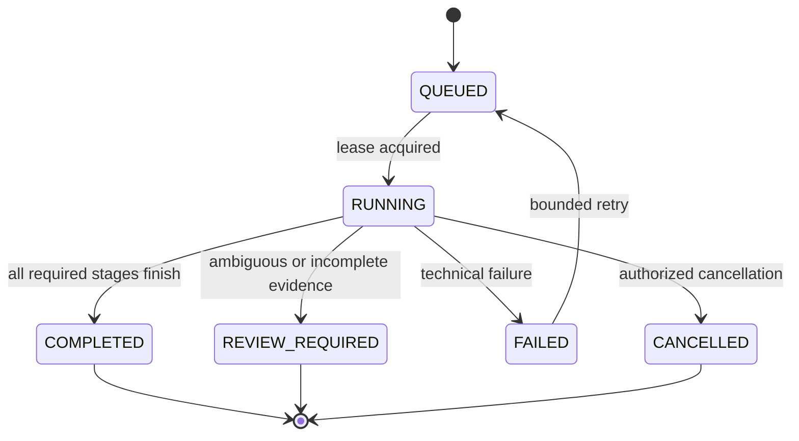
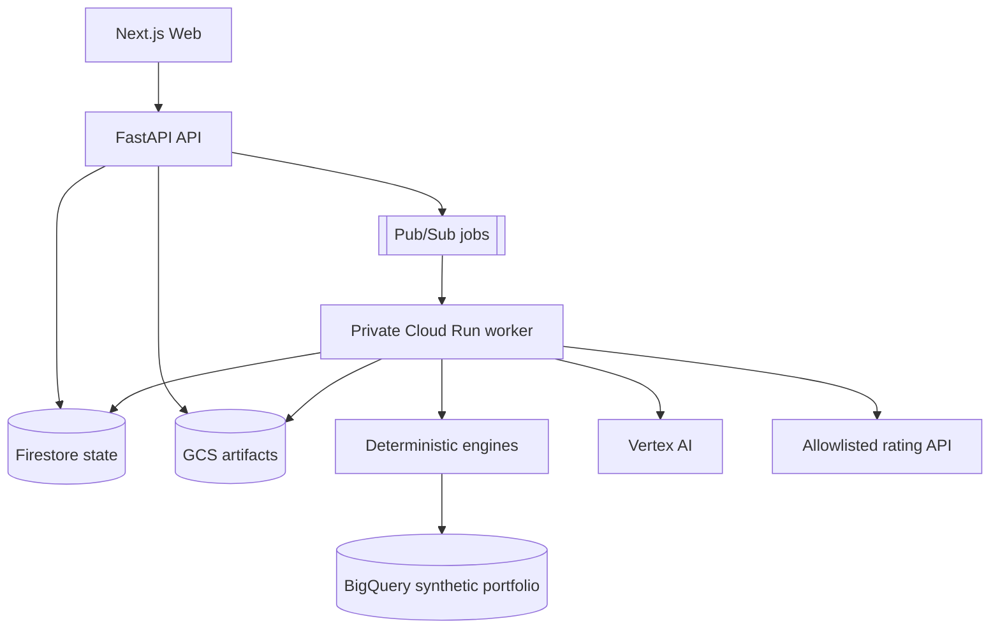

# RateGuard AI Enhanced — Locked Product and Engineering Source of Truth

**Version:** 1.0  
**Locked on:** September 17, 2026  
**Submission deadline:** October 7, 2026  
**Primary award:** InsurTech America 2026 — Future of Customer Protection Award  
**Secondary award:** InsurTech America 2026 — Best Emerging Product / Service  
**Build target:** A credible, deployed, judge-verifiable product demonstration—not a claim of full enterprise production certification

---

## 1. Executive decision

RateGuard AI Enhanced will be built as an **independent pricing-change assurance and consumer-impact attestation service**. It verifies that a candidate insurance rating implementation behaves like an approved pricing specification before deployment or before upcoming quotes and renewals are produced.

The October 7 product will prove one complete Arizona homeowners use case from source ingestion through release decision:

1. Compile an approved rate specification from either strict IPIR JSON or a **controlled RateGuard Excel workbook**.
2. Compile or query the candidate implementation through strict IPIR JSON or a **versioned REST rating-engine connector**.
3. Detect semantic and behavioral drift using deterministic engines.
4. Generate targeted boundary tests around changed rules.
5. Compare expected and candidate premiums with exact decimal arithmetic.
6. Quantify affected policies, overcharges, undercharges, and upcoming renewal impact using a synthetic, de-identified 50,000-policy portfolio.
7. Measure how impact is distributed across explicitly configured synthetic cohorts without asserting that a disparity is legally discriminatory.
8. Produce a human-reviewable consumer explanation draft whose factual values come only from the deterministic trace.
9. Issue a fail-closed release decision and store a tamper-evident evidence manifest.

The core product claim is:

> RateGuard independently proves whether a pricing change matches approved intent, identifies who could be financially affected before billing, and produces reviewable evidence for release, compliance, and customer-protection teams.

This scope directly fits the official **Future of Customer Protection** criterion—using AI and emerging technology to predict, prevent, quantify, and manage risk—and the **Best Emerging Product / Service** criterion—responding to technological, societal, and economic change with meaningful value. The official 2026 criteria and dates are published by [InsurTech America](https://insurtechamerica.com/innovation-challenge.html).

---

## 2. Truth standard and claim policy

Every submission, README, screen, pitch, and demo must follow these rules.

### 2.1 Permitted claims

- “Deterministically verifies supported pricing artifacts and target-engine responses.”
- “Detects silent premium drift in the demonstrated Arizona HO3 workflow.”
- “Quantifies potential customer impact using a synthetic 50,000-policy portfolio.”
- “Generates targeted tests at changed boundaries.”
- “Uses Gemini only for bounded semantic assistance and explanation drafting; Gemini never calculates premiums, exposure, policy counts, or the final release decision.”
- “Provides tamper-evident evidence through hashes, versioned artifacts, and an append-only mission event model.”
- “Produces draft consumer explanations for authorized human review.”
- “Supports a constrained, documented workbook contract.”

### 2.2 Prohibited claims

- “100% accurate,” “zero hallucinations,” “regulator approved,” “legally compliant,” “guarantees fair pricing,” or “eliminates all pricing errors.”
- “Supports arbitrary Excel workbooks, macros, PDFs, filings, Guidewire, Duck Creek, AS400, or any codebase” unless that exact adapter has passed the locked acceptance suite.
- “Detects demographic bias” or “proves unfair discrimination.” The MVP measures differential financial impact across configured test cohorts; legal fairness determinations require jurisdiction-specific rules, appropriate data, actuarial review, and counsel.
- “Live production renewal integration.” The challenge build simulates a forward-looking queue with synthetic, de-identified records.
- “Automatically sends policyholder letters.” It generates drafts only; a human must approve and export them.
- “Immutable ledger” or “blockchain.” The MVP evidence store is tamper-evident, not mathematically or legally immutable.
- Any real customer, carrier, loss, premium, or regulatory-impact assertion derived from the synthetic portfolio.

### 2.3 Confidence terminology

The UI and APIs use these distinct terms:

- **Schema valid:** the artifact conforms to the supported contract.
- **Semantically verified:** all references, ranges, effective dates, and supported operators pass deterministic validation.
- **Behaviorally verified:** oracle and target produce equal premiums for the executed test suite.
- **Extraction verified:** workbook-derived outputs match locked workbook control cases.
- **Attested:** required stages completed and their hashes are included in the evidence manifest.

None of these terms means universal correctness outside the tested scope.

---

## 3. Award-driven product positioning

### 3.1 Future of Customer Protection submission

Lead with prevention and measurable consumer harm:

- **Predict:** simulate the candidate release against upcoming synthetic new-business and renewal transactions.
- **Prevent:** fail closed before deployment or billing when material premium mismatch is confirmed.
- **Quantify:** show affected policy count, overcharged and undercharged policy counts, total absolute consumer impact, mean/median/max change, percentage change distribution, and renewal timing.
- **Manage:** provide root cause, evidence lineage, proposed remediation, revalidation, human approval, and auditable release decision.

The central demo sentence is:

> “Before a single renewal notice is produced, RateGuard finds the exact implementation defect, proves the premium difference, identifies the customers likely to be affected, and blocks the unsafe release with a reviewable evidence packet.”

### 3.2 Best Emerging Product / Service submission

Lead with the vendor-neutral product layer and current market need:

- Increasingly frequent rate changes create operational pressure.
- Pricing logic moves across spreadsheets, configuration, APIs, and core systems.
- Traditional functional tests often miss mathematically valid but incorrect premiums.
- IPIR creates a portable contract between actuarial intent and implementation.
- Targeted verification reduces the test set while preserving traceability to changed boundaries.
- The same evidence serves engineering, actuarial, compliance, and customer-protection users.

### 3.3 Product personas

The MVP has two primary personas in one application:

| Persona | Primary question | Required output |
|---|---|---|
| Pricing Release Owner | “Can this rate implementation safely ship?” | Diff, boundary tests, reconciliation, release decision, remediation and revalidation |
| Consumer Protection Reviewer | “Who could be harmed, by how much, and what can we accurately explain?” | Consumer-impact dashboard, queue impact, cohort distribution, explanation draft, evidence packet |

An administrator persona manages connectors, users, thresholds, and retention, but does not need a separate rich UI for the challenge.

---

## 4. Locked MVP scope

### 4.1 Must ship by October 7

#### A. Authentication and authorization

- Firebase Authentication with email/password for the controlled demo.
- API verifies Firebase ID tokens on every non-health endpoint.
- Roles: `ADMIN`, `RELEASE_OWNER`, `CONSUMER_REVIEWER`, `VIEWER`.
- Server-side authorization; hiding a button is never treated as access control.
- A mission stores tenant ID, creator ID, timestamps, and authorization-scoped artifact references.
- Challenge deployment is single-tenant, but every data record includes `tenant_id` to avoid hard-coding an unsafe future model.

#### B. Source ingestion

- Strict IPIR JSON input.
- RateGuard Controlled Workbook v1 (`.xlsx`) only.
- File-size limit: 10 MiB.
- Extension, MIME signature, ZIP-entry count, uncompressed-size, and path-traversal checks.
- Macro-enabled files (`.xlsm`), external links, OLE objects, embedded files, password-protected workbooks, volatile functions, and unsupported formulas are rejected.
- Workbook compilation receipt listing sheets, tables, formulas, supported/unsupported constructs, normalized counts, warnings, content hash, and verification status.
- No PDF ingestion in MVP.

#### C. Candidate implementation access

- Strict implementation IPIR JSON, plus one real REST connector contract.
- Connector endpoint is configured by an administrator; mission requests may select a connector but may not submit arbitrary URLs.
- The demo connector points to the isolated `backend/rating_engine` service with canonical and defective version identifiers.
- No direct Guidewire, Duck Creek, GitHub, GitLab, database, or arbitrary source-code access in MVP.
- A CI example may call the RateGuard API, poll the mission, and fail a sample pipeline on `BLOCK_DEPLOYMENT`; it is an integration example, not a complete GitHub App.

#### D. Deterministic assurance pipeline

- Package compatibility validation.
- Canonical semantic diff.
- Dependency-DAG impact analysis.
- Boundary and mutation-driven candidate generation.
- Deterministic test-set selection baseline; Gemini may reprioritize only IDs already generated.
- Independent Decimal-based premium oracle.
- Target connector execution.
- Trace reconciliation and first-divergence root cause.
- Synthetic portfolio and forward-looking queue impact.
- Cohort impact distribution.
- Fail-closed decision engine.
- Optional remediation proposal and mandatory revalidation before a proposed patch can be shown as verified.

#### E. Customer-protection outputs

- Consumer impact summary.
- Upcoming 30/60/90-day renewal impact buckets.
- Distribution by configured synthetic cohorts.
- Deterministic explanation-facts object.
- Gemini-generated plain-language draft using only those facts.
- Post-generation factual validator.
- Human status: `DRAFT`, `APPROVED`, `REJECTED`; no delivery integration.

#### F. Evidence and audit

- Append-only mission event records.
- SHA-256 hashes for original source, normalized IPIR, connector request/response batches, stage outputs, and final decision.
- Hash-chained final manifest referencing the previous event hash.
- Artifact object generation/version captured in the manifest.
- Downloadable JSON evidence bundle; PDF presentation is optional only if time remains.
- Gemini metadata includes model ID, prompt-template version, schema version, request hash, response hash, fallback flag, latency, token counts if supplied, and validation result. Do not persist hidden chain-of-thought.

### 4.2 Explicitly deferred

- Arbitrary workbook interpretation and automatic self-correction.
- PDF/OCR or regulatory filing extraction.
- VBA/macro execution.
- Native Guidewire, Duck Creek, Earnix, AS400, GitHub, or GitLab extraction.
- Vector database and long-term institutional memory.
- Production protected-class fairness assessment.
- Real policyholder PII or carrier production data.
- Automatic correspondence delivery.
- Multi-tenant SaaS billing, tenant provisioning, SSO/SAML, SCIM, or customer-managed encryption keys.
- Automatic production deployment approval.
- Blockchain or WORM-certified regulatory recordkeeping.

These are roadmap items, not hidden unfinished MVP work.

---

## 5. Controlled Workbook v1 contract

The earlier concept of parsing any actuarial workbook with openpyxl plus Gemini is not safe. `openpyxl` reads formulas but does not calculate Excel formulas, and workbook semantics can depend on macros, named ranges, external links, calculation mode, or Excel-specific behavior. The MVP therefore uses a constrained contract.

### 5.1 Required sheets

| Sheet | Purpose | Required columns |
|---|---|---|
| `RG_METADATA` | Package identity and applicability | key, value |
| `RG_INPUTS` | Rating inputs and constraints | id, name, data_type, required, minimum, maximum, allowed_values |
| `RG_CONSTANTS` | Decimal constants | id, name, value |
| `RG_TABLES` | Rate table rows | table_id, dimension_id, min, max, include_min, include_max, match_value, result_value, priority |
| `RG_CALCULATIONS` | Calculation graph | node_id, operator, operand_1, operand_2, rounding_mode, scale |
| `RG_OUTPUTS` | Final outputs | output_id, source_ref, currency |
| `RG_CONTROL_CASES` | Golden input/output examples | case_id, input JSON, expected output, tolerance |

### 5.2 Supported operators

`ADD`, `SUBTRACT`, `MULTIPLY`, `DIVIDE`, `MIN`, `MAX`, `ROUND`, `LOOKUP`, and a limited `IF` whose condition uses `EQ`, `NE`, `LT`, `LTE`, `GT`, `GTE`, `AND`, or `OR`.

No arbitrary Excel formula becomes executable code. Formulas are parsed into a safe AST; function names outside the allowlist are rejected. References outside the declared RateGuard tables are rejected.

### 5.3 Compilation stages

1. Quarantine upload under a generated ID; never trust the filename as a path.
2. Hash raw bytes.
3. Validate ZIP structure and reject active content or unsafe relationships.
4. Read values and formulas with `openpyxl` in non-executing mode.
5. Validate required sheets and columns.
6. Parse supported formulas into typed AST nodes.
7. Resolve all references and build the dependency DAG.
8. Detect cycles, gaps, overlapping ambiguous ranges, unreachable rows, invalid effective dates, duplicate IDs, division-by-zero paths, missing rounding, and currency inconsistencies.
9. Build canonical IPIR.
10. Execute every `RG_CONTROL_CASES` row using the independent oracle.
11. Compare results using exact Decimal rules and declared scale.
12. Mark the compile `VERIFIED`, `REVIEW_REQUIRED`, or `REJECTED`.

### 5.4 Gemini boundary

Gemini may suggest a semantic label for an unknown header only when the workbook explicitly opts into assisted mapping and the candidate labels come from a fixed schema. Its output is never accepted silently:

- selected field must be from the offered enum;
- confidence is recorded but not treated as truth;
- the resulting package must pass control cases;
- any unresolved or ambiguous mapping results in `REVIEW_REQUIRED`;
- the user must confirm the mapping before a mission can produce `PASS`.

There is no autonomous retry loop that edits mappings until test cases pass; that could overfit the controls and conceal a wrong interpretation.

---

## 6. IPIR v0.2 contract

IPIR is the canonical, vendor-neutral semantic contract. JSON Schema is authoritative; Pydantic models implement it.

### 6.1 Package envelope

```json
{
  "schema_version": "0.2.0",
  "package_id": "az_ho3_2026_10",
  "package_version": "1.0.0",
  "source": {
    "source_type": "CONTROLLED_XLSX",
    "artifact_sha256": "...",
    "compiler_version": "...",
    "compiled_at": "..."
  },
  "product": {
    "product_id": "AZ_HO3",
    "line": "HOMEOWNERS",
    "jurisdiction": {"country": "US", "state": "AZ"},
    "currency": "USD"
  },
  "effective_period": {"start": "2026-10-01", "end": null},
  "transaction_types": ["NEW_BUSINESS", "RENEWAL"],
  "inputs": [],
  "constants": [],
  "tables": [],
  "calculations": [],
  "outputs": [],
  "control_cases": [],
  "attestation": {}
}
```

### 6.2 Mandatory semantic rules

- IDs match `^[a-z][a-z0-9_]{1,63}$` and are unique within the package namespace.
- Decimal values are serialized as strings; binary floating point is forbidden in pricing arithmetic.
- Dates are ISO-8601 dates and intervals must be valid.
- References resolve to exactly one node.
- Calculation graph is acyclic.
- Range rows must be deterministically ordered, with overlaps rejected unless explicit priority is unique.
- Gaps are rejected for required total-coverage tables unless an explicit default exists.
- Every output specifies currency, scale, and rounding mode.
- Supported rounding modes are explicit, never inherited from a runtime default.
- Division nodes declare zero behavior; the default is reject.
- Every package carries compiler version, schema version, source hash, and validation receipt.

### 6.3 Expression model

Use a discriminated union rather than untyped dictionaries:

- `LiteralExpression`
- `ReferenceExpression`
- `UnaryExpression`
- `BinaryExpression`
- `NaryExpression`
- `ConditionalExpression`
- `TableLookupExpression`
- `RoundExpression`

Pydantic must use `extra="forbid"` recursively. JSON Schema fixtures must include valid and invalid examples.

### 6.4 Compatibility gate

Before comparison, require matching product line, jurisdiction, currency, overlapping effective period, and transaction type. A mismatch is `REVIEW_REQUIRED`, never `PASS`. Package schema major versions must match; minor-version migrations must be explicit and versioned.

---

## 7. End-to-end mission design

### 7.1 Mission modes

#### Release Conformance

Source A is explicitly authoritative. Source B is the candidate implementation. A confirmed material mismatch may lead to `BLOCK_DEPLOYMENT`. Remediation is directional from B toward A.

#### Symmetric Equivalence

Neither source is authoritative. Results use neutral labels and cannot propose a directional patch until a human selects a reference. This remains supported from the baseline but is secondary in the enhanced award demo.

### 7.2 State machine



The business decision is separate from execution status:

- `PASS`
- `BLOCK_DEPLOYMENT`
- `REVIEW_REQUIRED`
- `NO_DECISION` for failed/cancelled work

### 7.3 Required stages

1. `REQUEST_VALIDATION`
2. `SOURCE_A_LOAD`
3. `SOURCE_B_LOAD_OR_CONNECTOR_CHECK`
4. `COMPATIBILITY_GATE`
5. `SEMANTIC_DIFF`
6. `DEPENDENCY_IMPACT`
7. `TEST_CANDIDATE_GENERATION`
8. `TEST_SELECTION`
9. `ORACLE_EXECUTION`
10. `TARGET_EXECUTION`
11. `RECONCILIATION`
12. `PORTFOLIO_IMPACT`
13. `PIPELINE_IMPACT`
14. `COHORT_DISTRIBUTION`
15. `REMEDIATION`
16. `REVALIDATION`
17. `EXPLANATION_FACTS`
18. `EXPLANATION_DRAFT`
19. `DECISION`
20. `EVIDENCE_FINALIZATION`

Stages may be marked `NOT_APPLICABLE` with a reason. They may not silently disappear.

### 7.4 Release-decision truth table

| Condition | Decision |
|---|---|
| Invalid/unsupported source, incompatible packages, ambiguous assisted mapping, incomplete target responses, missing required evidence | `REVIEW_REQUIRED` |
| Any executed case has a material premium mismatch | `BLOCK_DEPLOYMENT` |
| Portfolio shows impact even if structural diff is empty | `BLOCK_DEPLOYMENT` |
| Remediation exists but revalidation fails | `BLOCK_DEPLOYMENT` |
| Zero structural diffs, zero behavioral mismatches, all required stages complete, sources verified | `PASS` |
| Non-material differences under an explicitly configured and recorded threshold | `REVIEW_REQUIRED` for MVP, not automatic `PASS` |

The threshold policy is versioned. For the challenge demo, any non-zero cent-level premium mismatch blocks. This avoids an arbitrary materiality judgment.

---

## 8. REST target-engine connector

### 8.1 Contract

The connector calls a preconfigured endpoint with a signed service-to-service request:

```json
{
  "request_id": "uuid",
  "engine_version": "defective-v1",
  "product_id": "AZ_HO3",
  "effective_date": "2026-10-15",
  "transaction_type": "RENEWAL",
  "inputs": {"roof_age": 25, "dwelling_limit": "300000.00"},
  "trace_requested": true
}
```

Response:

```json
{
  "request_id": "uuid",
  "engine_version": "defective-v1",
  "outputs": {"final_premium": "655.00"},
  "trace": [],
  "rated_at": "..."
}
```

### 8.2 SSRF and connector controls

- Users cannot provide a URL per mission.
- Connector hosts are administrator allowlisted.
- HTTPS required outside local development.
- Private/link-local/metadata IP destinations are denied unless explicitly implemented through a private connector architecture.
- Redirects are disabled.
- DNS is resolved and checked before connection; response size and time are bounded.
- Connect timeout 3 seconds; request timeout 10 seconds; mission-level target budget 60 seconds.
- Retry only safe/idempotent requests, with capped exponential backoff and jitter.
- Request IDs provide idempotency and correlation.
- Connector credentials come from Secret Manager or workload identity, never mission JSON or logs.
- Raw target traces are treated as sensitive and stored under the mission authorization scope.

### 8.3 Demo engine

The isolated demo service exposes exactly two versioned behaviors:

- `canonical-v1` returns the locked canonical quote of **$700.00** for the golden case.
- `defective-v1` returns **$655.00** for the same case due to one documented rate-factor drift.

Startup self-tests must prove both values before the service becomes ready.

---

## 9. Consumer impact and fairness-safe design

### 9.1 Portfolio and pipeline datasets

The demo uses synthetic records only. The data generator is seeded and versioned so results are reproducible. Each record includes:

- synthetic policy ID;
- product, state, transaction type, effective/renewal date;
- rating inputs required by IPIR;
- current and candidate version identifiers;
- configured synthetic cohort labels;
- no name, street address, email, phone, SSN, date of birth, or real policy number.

The upcoming pipeline is a BigQuery view over records with effective or renewal dates in the next 90 days. It is not represented as a live carrier feed.

### 9.2 Consumer impact metrics

All metrics are deterministic SQL/Python outputs:

- total evaluated;
- affected count and rate;
- overcharged count and amount;
- undercharged count and amount;
- net carrier impact;
- total absolute consumer impact;
- mean, median, P95, and maximum dollar change;
- mean, median, P95, and maximum percentage change;
- 30/60/90-day affected renewal counts;
- count by root-cause rule;
- count by configured cohort.

“Carrier exposure” and “consumer impact” must be displayed separately; a net value may hide offsetting overcharges and undercharges.

### 9.3 Cohort distribution—not a legal fairness verdict

For each configured cohort, calculate selection rate, affected rate, mean absolute change, mean percentage change, and overcharge rate. Display sample size and suppress cohorts below a configurable minimum such as 30.

The UI label is **Impact Distribution Review**. It includes this statement:

> “This screening identifies uneven outcomes in the supplied test cohorts. It is not a legal finding of unfair discrimination and does not replace actuarial, compliance, or legal review.”

Protected-class or proxy analysis with real data is out of scope. The NAIC Model Bulletin encourages governance, validation, data lineage, bias analysis, transparency, and controls proportionate to consumer harm; it does not make a generic software metric a compliance determination. See the official [NAIC Model Bulletin on AI use by insurers](https://content.naic.org/sites/default/files/cmte-h-big-data-artificial-intelligence-wg-ai-model-bulletin.pdf.pdf).

---

## 10. Consumer explanation drafting

### 10.1 Two-step architecture

**Step 1 — deterministic facts**

The system derives a signed `ExplanationFacts` object from the reconciliation trace:

```json
{
  "case_id": "case-025",
  "currency": "USD",
  "prior_premium": "686.00",
  "new_premium": "700.00",
  "net_change": "14.00",
  "approved_factors": [
    {"label": "roof age band", "effect": "19.00"},
    {"label": "protective device credit", "effect": "-5.00"}
  ],
  "effective_date": "2026-10-15",
  "facts_sha256": "..."
}
```

**Step 2 — bounded language generation**

Gemini receives the facts, an approved glossary, tone requirements, prohibited phrases, and a JSON output schema. It returns a draft and citations to fact IDs. A validator extracts every amount/date from the draft and requires exact membership in the facts object. Unsupported values, causes, legal language, or recommendations cause rejection and deterministic-template fallback.

### 10.2 Safety controls

- No raw PII is sent to Gemini.
- No invented reasons such as climate, credit, claims, neighborhood, or risk are permitted.
- Drafts cannot state regulatory compliance, blame, eligibility, or coverage advice.
- Prompt injection content from source files is data, not instruction, and is delimited and schema-normalized.
- Draft output is labeled “For authorized review—not sent.”
- Approval identity and timestamp are logged.
- Demo exports only a synthetic example.

---

## 11. Gemini use and model lock

### 11.1 Model

Use **`gemini-3.1-flash-lite`** through Vertex AI with the Google Gen AI SDK, region `us` if supported by the SDK/model combination. Pin the model ID in configuration and record it per invocation. The model is GA, supports structured output, and has a retirement date no earlier than May 7, 2027 according to [Google Cloud model documentation](https://docs.cloud.google.com/gemini-enterprise-agent-platform/models/gemini/3-1-flash-lite).

Do not use `gemini-2.0-flash-001`; Google lists Gemini 2.0 Flash as discontinued as of June 1, 2026 in its [official release notes](https://docs.cloud.google.com/gemini-enterprise-agent-platform/release-notes).

### 11.2 Authentication

- Cloud Run uses its attached worker service account and Application Default Credentials.
- Do not use `GEMINI_API_KEY` in deployed services.
- After code migration is verified, disable and remove the API-key secret through a separately reviewed infrastructure change.
- Do not store a Firebase Admin private-key JSON in production. Validate Firebase tokens with Admin SDK plus ADC.

### 11.3 Allowed LLM decisions

- assisted mapping from a fixed candidate enum;
- prioritization of deterministic difference IDs;
- selection from deterministic test IDs;
- explanation drafting from deterministic facts;
- remediation narrative or patch choice from deterministic candidates.

### 11.4 Forbidden LLM decisions

- premium arithmetic;
- rate-table lookup;
- policy or dollar aggregation;
- source validity;
- final release decision;
- legal compliance or discrimination finding;
- arbitrary code execution;
- connector URL or credential selection.

Every LLM call has temperature set for consistency, strict response schema, token limit, timeout, retry cap, candidate-ID validation, request/response hashes, and deterministic fallback.

---

## 12. Locked technical architecture



### 12.1 Stack

| Layer | Locked choice |
|---|---|
| Frontend | Next.js 14 baseline, TypeScript strict mode, React, Tailwind; do not perform a framework upgrade before submission unless required by a critical security fix |
| API | Python 3.12, FastAPI, Pydantic v2, Uvicorn/Gunicorn-compatible Cloud Run entrypoint |
| Worker | Same Python package/image as API with separate command and least-privileged service account |
| Deterministic math | Python `Decimal`; explicit currency scale and rounding |
| Workbook parsing | `openpyxl` in non-executing mode plus ZIP/XML safety inspection; no LibreOffice or Excel execution in production |
| Async queue | Pub/Sub push subscription with authenticated OIDC and DLQ |
| State | Firestore transactions for mission state, lease, idempotency, and events |
| Artifacts | Cloud Storage with uniform access, versioning, lifecycle policy, and hashes |
| Analytics | BigQuery parameterized queries over synthetic portfolio tables/views |
| AI | Vertex AI, Google Gen AI SDK, `gemini-3.1-flash-lite`, structured output |
| Identity | Firebase Authentication for user identity; server-side RBAC in API |
| Containers | Cloud Build + Artifact Registry + Cloud Run; immutable image digests |
| IaC | Terraform preferred; if deadline prevents full conversion, checked-in idempotent `gcloud` scripts are acceptable for challenge scope |
| Tests | Pytest, Hypothesis for invariants, contract tests, Playwright for critical UI flows |
| Observability | Cloud Logging structured JSON, Cloud Monitoring metrics/alerts, trace/correlation IDs |

### 12.2 Service boundaries

- `web`: public, contains no secrets, communicates only with API.
- `api`: public HTTPS endpoint, authenticated for application operations, validates and queues work; never performs long missions.
- `worker`: not unauthenticated; accepts only authenticated Pub/Sub push identity; executes missions.
- `rating-engine-demo`: private/authenticated if deployed separately; no public anonymous invocation.

The public `/health/live` endpoint returns process liveness only. `/health/ready` may expose a minimal status but no project IDs, service-account names, secrets, stack traces, or dependency credentials.

---

## 13. API contract

All endpoints are under `/api/v1`; request and response models forbid unknown fields where practical.

### 13.1 Sources

- `POST /sources/uploads` — issue/upload artifact under authenticated tenant.
- `POST /sources/{source_id}/compile` — compile supported JSON/XLSX.
- `GET /sources/{source_id}` — metadata and compile receipt.
- `GET /sources/{source_id}/artifacts/{artifact_id}` — authorized signed download or streamed response.

### 13.2 Connectors

- `GET /connectors` — list safe metadata for configured connectors.
- `POST /connectors/{connector_id}/test` — admin only; safe golden-case health test.
- No endpoint accepts an arbitrary remote URL from normal users.

### 13.3 Missions

- `POST /missions` — requires idempotency key.
- `GET /missions/{mission_id}` — summary and current status.
- `GET /missions/{mission_id}/events` — ordered stage events.
- `GET /missions/{mission_id}/results` — typed final results.
- `POST /missions/{mission_id}/cancel` — authorized cancellation request.
- `POST /missions/{mission_id}/alignment` — equivalence reference selection.
- `GET /missions/{mission_id}/evidence` — evidence manifest/bundle.

### 13.4 Explanation review

- `POST /missions/{mission_id}/explanations` — create synthetic-case draft.
- `POST /explanations/{id}/approve` — reviewer role.
- `POST /explanations/{id}/reject` — reviewer role with reason.

### 13.5 Error model

```json
{
  "error": {
    "code": "UNSUPPORTED_WORKBOOK_FUNCTION",
    "message": "Workbook contains a function outside the supported contract.",
    "correlation_id": "...",
    "details": [{"sheet": "RG_CALCULATIONS", "cell": "F20", "function": "INDIRECT"}]
  }
}
```

No stack trace or secret value is returned to clients.

---

## 14. Persistence model

### 14.1 Firestore collections

- `tenants/{tenant_id}`
- `users/{uid}` with role bindings
- `sources/{source_id}`
- `connectors/{connector_id}` metadata only; no secret material
- `missions/{mission_id}`
- `missions/{mission_id}/events/{sequence}`
- `missions/{mission_id}/evidence/{evidence_id}`
- `missions/{mission_id}/explanations/{explanation_id}`
- `idempotency/{tenant_id}:{key}`

Mission document updates use transactions and a monotonic `state_version`. The worker lease contains owner, acquired time, heartbeat, and expiry. A duplicate message may resume or acknowledge existing work but cannot create a second final decision.

### 14.2 Cloud Storage paths

Use generated IDs, not original filenames:

`tenants/{tenant_id}/sources/{source_id}/raw/{artifact_id}`  
`tenants/{tenant_id}/sources/{source_id}/compiled/{artifact_id}`  
`tenants/{tenant_id}/missions/{mission_id}/evidence/{artifact_id}`

Store original filename only as sanitized metadata. Enable uniform bucket-level access and object versioning. Add lifecycle rules after the demo retention period is decided. Do not publicly expose the bucket.

### 14.3 BigQuery

Tables:

- `synthetic_policies_v1`
- `synthetic_pipeline_v1`
- `portfolio_run_results`
- `cohort_run_results`

Queries use parameters and mission-scoped staging tables or deterministic query outputs. A cleanup job removes expired mission results. The worker service account receives access only to the required dataset, not project-wide data editor permissions.

---

## 15. Security architecture and immediate infrastructure corrections

### 15.1 Immediate corrections to the completed setup

| Current item | Risk | Locked correction |
|---|---|---|
| `gemini-2.0-flash-001` | Discontinued; calls may fail | Change to `gemini-3.1-flash-lite` and run a structured-output smoke test |
| `GEMINI_API_KEY` secret | Long-lived key is unnecessary on Cloud Run | Use worker ADC; disable/remove key after verified migration |
| `FIREBASE_ADMIN_KEY` JSON | Long-lived private key increases credential risk | Use ADC with Firebase Admin SDK; remove key from runtime and later destroy secret version through reviewed change |
| `roles/firebase.sdkAdminServiceAgent` granted to app SAs | Service-agent roles are not normal application roles and violate least privilege | Remove after validating the minimal permissions actually needed; token verification should not require it |
| API/worker `storage.objectAdmin` | Includes object deletion and broad write capability | Split raw/evidence buckets if feasible; grant object creator/viewer or scoped bucket roles as required |
| Worker `bigquery.dataEditor` at broad scope | Excessive data mutation | Bind dataset-level access only; separate job-user project permission from dataset data access |
| No source push subscription listed | Jobs cannot reach worker | Create `assurance-runs-push` with OIDC-authenticated push to `/internal/pubsub/assurance-runs` |
| DLQ topic exists but forwarding IAM not confirmed | Dead-letter forwarding can silently fail | Grant Pub/Sub service agent publisher on DLQ topic and subscriber on source subscription as required; test poison-message delivery |
| Web SA has only `run.invoker` | May be unnecessary depending on browser-to-API architecture | Document whether browser calls public API or web performs server-side proxy; grant only the chosen path |

These changes should be performed through explicit infrastructure commands after code paths are ready; do not delete secrets blindly during development.

### 15.2 Authentication and session controls

- Verify token issuer, audience/project, signature, expiration, and revocation policy.
- Do not trust client-provided email, role, tenant, or user ID.
- Use `Authorization: Bearer` headers; do not place tokens in URLs.
- Enforce CORS allowlist for the deployed web origin; no wildcard with credentials.
- Add per-user and per-tenant request limits.
- Prevent user enumeration in login errors.
- Demo credentials are not committed and should be rotated after judging.

### 15.3 File-security controls

- Reject oversized bodies before full buffering where possible.
- Validate actual file signatures.
- Limit ZIP entries and compression ratio to prevent ZIP bombs.
- Never execute workbook macros or formulas.
- Reject path traversal and unsafe XML relationships.
- Store uploads outside application filesystem persistence.
- Sanitize values before displaying them to prevent stored XSS or spreadsheet-formula injection on export.
- Malware scanning is desirable for enterprise deployment; for challenge scope, active-content rejection and isolation are mandatory and the limitation is documented.

### 15.4 Application and AI security

- Strict input/output schemas.
- Parameterized BigQuery SQL.
- No `eval`, `exec`, shell execution, dynamic imports, or untrusted pickle/yaml loaders.
- Connector allowlist prevents SSRF.
- Secrets are redacted from logs.
- Prompt templates are version controlled.
- Untrusted source text cannot alter system instructions or tool permissions.
- Gemini has no direct tool for database mutation, deployment, customer communication, or release approval.

### 15.5 Supply-chain controls

- Pin Python and npm dependencies with lockfiles.
- Run dependency and container vulnerability scanning in CI.
- Generate an SBOM for release images if time permits.
- Deploy by immutable image digest, not mutable tags.
- Protect `main` with required tests and secret scanning.
- Never print `.env`, Firebase config credentials, access tokens, or service-account JSON in CI logs.

### 15.6 Governance basis

The governance approach follows the spirit of the NAIC Model Bulletin: documented governance, controls proportional to possible consumer harm, validation, data lineage, explainability, human oversight, and evidence available for examination. It also maps naturally to the NIST AI RMF functions—Govern, Map, Measure, and Manage—described in the [NIST AI Risk Management Framework](https://www.nist.gov/itl/ai-risk-management-framework). This is an alignment statement, not certification.

---

## 16. Reliability and operational design

### 16.1 Delivery semantics

Pub/Sub is at-least-once. Exactly-once business effect is achieved through:

- mission idempotency key;
- atomic Firestore lease;
- stage checkpointing;
- deterministic artifact IDs or compare-and-set writes;
- final-decision transaction guarded by `state_version`;
- duplicate-message acknowledgement after terminal state is observed.

### 16.2 Retry policy

Classify failures:

- **Retryable:** transient Vertex 429/5xx, connector timeout, temporary GCP service error.
- **Non-retryable:** invalid schema, unsupported workbook, compatibility failure, authorization failure.
- **Review required:** incomplete target batch, ambiguous mapping, evidence inconsistency.

Cap delivery attempts at five, use exponential backoff with jitter, and send poison messages to the DLQ. A DLQ message creates an alert and a visible mission failure reason.

### 16.3 Time budgets

Target demo SLOs, not contractual enterprise SLAs:

- API enqueue P95 under 750 ms excluding upload transfer.
- Source compile P95 under 10 seconds for the locked sample workbook.
- Full 50,000-policy mission P95 under 120 seconds.
- Mission status availability 99% during the judging window.
- No false `PASS` in the locked negative test suite.

If an external dependency exceeds its budget, the mission returns `REVIEW_REQUIRED` or `FAILED`; it never guesses.

### 16.4 Observability

Every log entry includes correlation ID, mission ID, tenant ID, service, stage, severity, event type, and duration. Do not log rating-input payloads by default.

Metrics:

- mission count and duration by decision;
- queue age;
- stage failure rate;
- retry and DLQ count;
- Gemini call/fallback/invalid-schema rate and latency;
- connector error and timeout rate;
- workbook rejection reason counts;
- evidence finalization failures;
- authentication/authorization denials.

Alerts:

- DLQ message count > 0;
- worker 5xx or mission failure spike;
- queue age beyond five minutes;
- evidence manifest failure;
- authentication anomaly;
- monthly budget threshold.

### 16.5 Cost controls

- Cloud Billing budget alerts at conservative thresholds.
- Hard per-mission test, token, and portfolio row limits.
- Maximum concurrent worker instances.
- BigQuery maximum bytes billed per query.
- Artifact lifecycle policy.
- Gemini call count and token ceiling.

---

## 17. Validation and QA master plan

### 17.1 Test pyramid

#### Unit and property tests

- IPIR schema and semantic validators.
- Every AST operator.
- Exact Decimal and rounding behavior.
- Range boundaries, gaps, overlaps, inclusivity, and priority.
- DAG cycle detection and evaluation ordering.
- Diff classification.
- Boundary generation invariants.
- Reconciliation first-divergence logic.
- Decision truth table.
- Explanation numeric-fact validator.
- Hash-chain verification.
- RBAC authorization matrix.

Use Hypothesis for range partitioning, arithmetic invariants, and serialization round trips.

#### Golden workbook tests

- Valid canonical workbook compiles and produces $700.00.
- Valid defective workbook compiles or target returns $655.00.
- Unknown function rejects.
- Macro-enabled workbook rejects.
- External link rejects.
- Hidden dependency outside contract rejects.
- Duplicate IDs reject.
- Missing control case causes `REVIEW_REQUIRED`.
- Overlapping ambiguous ranges reject.
- Formula cycle rejects.
- Tampered workbook changes source hash and invalidates prior attestation.

#### Connector contract tests

- canonical and defective results;
- authentication denied;
- timeout;
- 429 and 5xx retry;
- malformed JSON;
- wrong request ID;
- partial batch;
- oversized response;
- redirect/SSRF attempt rejected;
- duplicate request returns stable response.

#### Integration tests

- API → Firestore → Pub/Sub → worker → artifacts → final decision.
- Duplicate Pub/Sub delivery executes one logical mission.
- Worker crash and lease-expiry recovery.
- DLQ poison-message path.
- Gemini invalid output triggers fallback.
- Gemini unavailable does not fabricate results.
- BigQuery scan reproduces seeded expected metrics.
- Evidence bundle validates independently.

#### End-to-end browser tests

- login/logout and unauthorized access.
- release-owner mission flow.
- consumer-reviewer flow.
- clean mission `PASS`.
- defective mission `BLOCK_DEPLOYMENT`.
- unsupported workbook rejection.
- explanation draft review.
- evidence download.

### 17.2 Locked acceptance scenarios

| ID | Scenario | Expected result |
|---|---|---|
| A1 | Canonical spec vs canonical engine | `PASS`; $700 golden quote; zero mismatches; Gemini not needed for pricing |
| A2 | Canonical spec vs defective engine | `BLOCK_DEPLOYMENT`; $700 vs $655; $45 difference; exact first divergent factor |
| A3 | Boundary ages around changed rule | Tests include adjacent values below, at, and above the boundary |
| A4 | 50K synthetic portfolio | Reproducible affected count and consumer-impact metrics match approved fixture |
| A5 | Next-90-day queue | Reproducible 30/60/90-day counts match approved fixture |
| A6 | Cohort screening | Metrics, sample sizes, and disclaimer render; no legal verdict |
| A7 | Explanation draft | Every amount/date maps to signed facts; unsupported output falls back |
| A8 | Unsupported formula workbook | Compile rejected with cell/function location; mission cannot run |
| A9 | Gemini outage | Deterministic verification completes or returns honest review state; no false `PASS` |
| A10 | Target timeout/partial result | `REVIEW_REQUIRED` or technical failure; never `PASS` |
| A11 | Duplicate queue message | One final decision and one logical evidence chain |
| A12 | Cross-role/cross-tenant read attempt | 403/404 according to disclosure policy; no data leakage |
| A13 | Evidence tampering | Independent verifier reports hash mismatch |
| A14 | Product/jurisdiction mismatch | `REVIEW_REQUIRED`; no misleading portfolio comparison |

### 17.3 Definition of “no false PASS”

CI must contain mutation tests that change every supported pricing construct one at a time: constant, rate-table value, boundary inclusivity, effective date, calculation order, operator, rounding rule, and output reference. A mission may `PASS` only if the relevant negative mutations are detected by structural or behavioral evidence.

This does not prove absence of all possible defects; it proves the locked supported mutations cannot incorrectly pass.

---

## 18. UI information architecture

### 18.1 Navigation

- **Overview** — product promise, latest missions, safety status.
- **Sources** — upload, compile, receipt, limitations.
- **Missions** — create and review verification missions.
- **Consumer Impact** — portfolio, upcoming queue, cohort distribution.
- **Explanations** — synthetic drafts and review status.
- **Evidence** — lineage, hashes, model/fallback metadata, download.
- **Administration** — minimal connector and threshold display for admins.

### 18.2 Mission result tabs

1. Decision summary
2. Semantic differences
3. Dependency impact
4. Boundary tests
5. Reconciliation/root cause
6. Consumer impact
7. Upcoming pipeline
8. Impact distribution
9. Remediation/revalidation
10. Explanation preview
11. Evidence lineage

The first screen must explain the consequence in plain language before displaying system internals.

### 18.3 Required result headline

For the defective demo:

> **Deployment blocked:** the candidate engine quoted $655.00 instead of the approved $700.00 for the golden case. RateGuard traced the $45.00 undercharge to the changed roof-age factor and identified the affected synthetic renewals before billing.

For clean control:

> **Verification passed:** supported sources were compatible, required evidence completed, and no premium mismatch was reproduced in the executed test and synthetic portfolio scope.

---

## 19. Repository structure

Preserve the existing monorepo and add clear bounded modules:

```text
backend/
  app/
    api/v1/
    auth/
    connectors/
    decision/
    evidence/
    explanations/
    ingestion/
      json/
      workbook_v1/
    ipir/v0_2/
    missions/
    engines/
    storage/
  rating_engine/
  tests/
    contract/
    e2e/
    fixtures/
    integration/
    property/
    unit/
frontend/
  src/app/
  src/components/
  src/lib/
data/
  samples/
  synthetic/
docs/
  architecture/
  compliance/
  demo/
  threat-model/
infrastructure/
  terraform/ or scripts/
scripts/
  verify_evidence.py
  verify_deployed_system.py
```

Required documentation:

- `README.md` — concise public product and demo guide.
- `docs/architecture/SOURCE_OF_TRUTH.md` — this locked plan.
- `docs/threat-model/THREAT_MODEL.md`.
- `docs/compliance/CLAIMS_AND_LIMITATIONS.md`.
- `docs/demo/ACCEPTANCE_RESULTS.md` generated from the final deployed run.
- `SECURITY.md`, `LICENSE`, and `.env.example` files with placeholders only.

---

## 20. Delivery plan: September 17–October 7

### Phase 0 — Correct foundations (Sep 17–18)

- Copy this document into `docs/architecture/SOURCE_OF_TRUTH.md`.
- Change model to `gemini-3.1-flash-lite`; prove structured-output call using ADC.
- Define IPIR v0.2 and migrate fixtures without breaking baseline mission behavior.
- Build sample workbook generator and deterministic demo rating engine.
- Verify $700 canonical and $655 defective golden cases.
- Add current-state test baseline before feature changes.

**Exit gate:** local deterministic golden cases pass; no secret is committed; supported model smoke test passes.

### Phase 1 — Secure ingestion and connector (Sep 19–22)

- Implement Controlled Workbook v1 compiler and receipts.
- Implement active-content/ZIP safety rejection.
- Implement connector registry and REST contract.
- Add SSRF, timeouts, retries, response validation, and contract tests.
- Connect mission source B to real demo engine responses.

**Exit gate:** valid workbook compiles; unsafe/unsupported workbooks fail closed; connector negative tests pass.

### Phase 2 — Consumer protection modules (Sep 23–26)

- Version seeded 50K synthetic portfolio.
- Add 30/60/90-day pipeline view.
- Implement overcharge/undercharge and absolute-impact metrics.
- Implement cohort distribution with minimum-size suppression and disclaimer.
- Build consumer-reviewer screens.

**Exit gate:** impact results are reproducible and trace back to mission/test predicates.

### Phase 3 — Explanation and evidence (Sep 27–29)

- Build deterministic explanation facts.
- Add Gemini draft with strict schema and factual validation.
- Add deterministic fallback template and approval workflow.
- Finalize evidence hashes, chain, bundle, and independent verifier.

**Exit gate:** injected unsupported number/cause is rejected; modified evidence fails verification.

### Phase 4 — Security, reliability, and deployed E2E (Sep 30–Oct 2)

- Enforce Firebase API authentication and RBAC.
- Replace runtime private keys/API key with ADC paths.
- Tighten IAM and bucket/dataset scope.
- Create authenticated Pub/Sub push subscription and verify DLQ.
- Add idempotency, lease recovery, rate limits, logs, metrics, alerts, and budget controls.
- Deploy by digest to a no-traffic candidate, run acceptance suite, then promote.

**Exit gate:** A1–A14 pass in deployed environment; no high-severity vulnerability or credential exposure remains.

### Phase 5 — Submission quality (Oct 3–5)

- Freeze features.
- Run performance and failure drills.
- Capture screenshots and a short video from the deployed build.
- Rewrite README and submissions using only verified claims.
- Prepare two category-specific narratives from the same product.
- Generate acceptance-results document with mission IDs and timestamps.

**Exit gate:** every submission claim maps to visible UI or saved test evidence.

### Buffer and submit (Oct 6–7)

- Fix only blocker/critical issues.
- Run clean and defective demos from a fresh browser session.
- Export evidence bundles and verify hashes.
- Submit before the final-day risk window where possible.
- Tag the deployed commit and record image digests.

---

## 21. Risk register

| Risk | Likelihood | Impact | Mitigation / decision |
|---|---:|---:|---|
| Arbitrary Excel semantics cannot be safely reproduced | High | Critical | Constrained workbook contract; reject macros, external links, and unsupported functions |
| LLM maps a field incorrectly | Medium | High | Fixed candidate enum, control cases, human confirmation, fail to review state |
| LLM invents explanation details | Medium | High | Deterministic facts, fact-ID citations, numeric/date validator, deterministic fallback |
| Discontinued Gemini model breaks deployment | Certain without change | Critical | Move immediately to GA `gemini-3.1-flash-lite` and ADC |
| False `PASS` | Low after controls | Critical | Conservative truth table, mutation suite, incomplete evidence never passes |
| Portfolio metrics mislead because net values cancel | Medium | High | Report overcharge, undercharge, absolute impact, and net separately |
| Fairness claim exceeds evidence | High | High | Rename to Impact Distribution Review; disclaimer; no legal verdict |
| SSRF through connector URL | Medium | Critical | Admin registry, allowlist, no per-mission URLs, redirect and IP controls |
| Formula/ZIP upload attack | Medium | High | Non-execution, signature/relationship checks, size and ratio limits, quarantine |
| Duplicate Pub/Sub execution | High by delivery design | High | Transactional lease, idempotent stages, versioned finalization |
| Pub/Sub/DLQ IAM is incomplete | Medium | High | Dedicated deployment test including poison-message delivery |
| Long-lived Firebase/Gemini keys leak | Medium | Critical | ADC; remove runtime dependency; rotate/delete keys after verified cutover |
| Broad IAM enables accidental deletion | Medium | High | Bucket/dataset-scoped roles; separate runtime identities; deletion protection where feasible |
| Real PII reaches logs or Gemini | Low in synthetic MVP | Critical | Synthetic-only input, schema allowlist, redaction, payload logging off |
| Deadline is consumed by platform adapters | High | High | Native enterprise adapters deferred; REST connector is the extensibility proof |
| Demo exceeds two minutes | Medium | Medium | Async mission, progress UI, prepared clean/defective evidence, target P95 under 120 sec |
| “Ledger” wording implies immutability | Medium | Medium | Use “tamper-evident evidence ledger”; document storage controls and limitations |
| Single developer introduces regression in mature baseline | Medium | High | Feature flags, small vertical slices, mandatory baseline regression suite, feature freeze Oct 3 |

---

## 22. Final acceptance and release gate

The project is submission-ready only when all statements below are true:

### Product

- One clean and one defective mission run end to end on the deployed environment.
- Defective case proves $700 vs $655 and pinpoints the documented root cause.
- Consumer and upcoming-pipeline metrics are reproducible from the seeded 50K dataset.
- Cohort screen uses careful wording and sample-size handling.
- Explanation draft contains no unsupported facts and requires human approval.

### Engineering

- IPIR v0.2 schema and semantic validators pass.
- Controlled workbook compiler rejects every locked unsafe/unsupported fixture.
- REST connector contract, SSRF controls, timeouts, and negative tests pass.
- Duplicate queue delivery does not duplicate final business effects.
- Evidence bundle passes the independent verifier; tampered bundle fails.
- No failed/incomplete path can return `PASS`.

### Security

- All business APIs require verified identity and server-side authorization.
- No service-account JSON or Gemini API key is needed at runtime.
- No secrets exist in repository history or frontend bundles.
- Runtime IAM is scoped to required resources.
- Public services, CORS origins, connector destinations, upload types, and sizes are explicitly allowlisted.

### Operations

- Authenticated Pub/Sub push and DLQ are tested.
- Logs and metrics use mission correlation without raw sensitive payloads.
- Budget alerts and resource ceilings are configured.
- Image digest, deployed revision, model ID, schema version, and demo mission IDs are recorded.

### Submission integrity

- Award name is accurate: **Best Emerging Product / Service**.
- Synthetic data is prominently disclosed.
- No arbitrary Excel/PDF, legal fairness, regulator approval, or “100% accuracy” claim appears.
- Every numerical result in the application and demo can be reproduced.
- The public README matches the deployed behavior.

---

## 23. Roadmap after the challenge

Only after the MVP is accepted:

1. Add carrier-specific adapters behind the same connector contract.
2. Validate workbook support against a representative corpus and publish measured extraction performance by construct—not a single marketing accuracy number.
3. Add filing-PDF extraction as assisted evidence capture with page-level citations and mandatory human reconciliation.
4. Add enterprise identity, tenant isolation, private networking, CMEK/VPC-SC, configurable retention, and security review.
5. Pilot with de-identified carrier data under a data-processing agreement.
6. Design jurisdiction-specific governance and fairness reviews with actuaries, compliance, and counsel.
7. Add an institutional defect library only after retention, access, deletion, poisoning, provenance, and cross-tenant isolation controls are designed.
8. Pursue independent penetration testing, disaster-recovery testing, and control assurance before representing RateGuard as enterprise production-ready.

---

## 24. Locked conclusion

RateGuard wins credibility by refusing to blur the line between what is demonstrated and what is aspirational. The October product is not an omniscient filing reader, a legal compliance oracle, or a replacement for actuaries. It is a concrete preventive control: a supported pricing specification, an independent oracle, a real candidate-engine connection, targeted tests, quantified synthetic consumer impact, controlled explanations, a conservative decision gate, and verifiable evidence.

That is both achievable by the deadline and materially aligned with the challenge: **find the silent error, prove its consequence, protect the customer before billing, and give accountable humans the evidence to act.**

